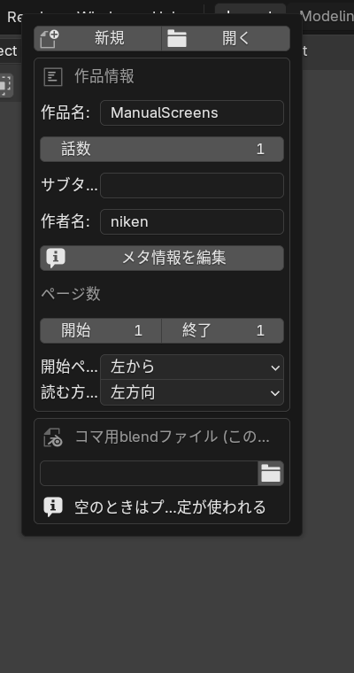
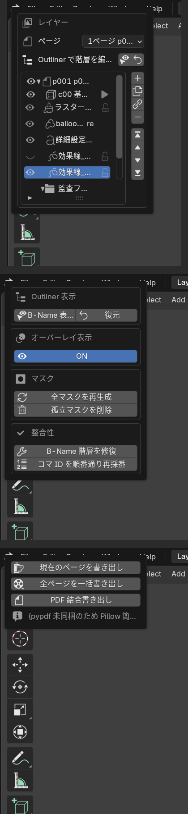
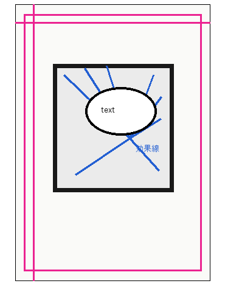
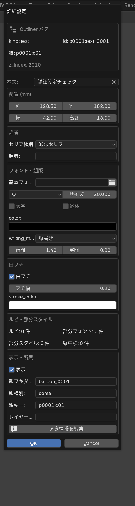

# B-MANGA マニュアル

最終更新: 2026-07-18
対象: B-MANGA 0.6.543 / Blender 5.2 LTS（開発基準バージョン。UIに変更はなく、画面例は Blender 5.1.1 実機のまま流用）

## 概要

B-MANGA は、Blender 上で漫画ネーム・絵コンテを作成するためのアドオンです。

B-MANGA 本体の担当範囲は、ページ一覧ファイルでの作画と、コマ用blendファイルでの 3D ビューポート上のモデル配置です。魚眼レンダリング、キャラ・背景などの出力プリセット、複雑なレンダー出力は別アドオンの B-MANGA Render で扱います。

B-MANGA 本体にも、ページ一覧ファイルから直接使う「ページ出力」は残っています。

画面例は Blender 5.1.1 実機で撮影したスクリーンショットです。B-MANGA タブ内の各セクションは、同じパネルを Blender のポップアップ表示で撮影したものを含みます。Blender の表示幅、テーマ、サイドバーの開閉状態によって見え方は少し変わります。

## インストールと有効化

### 通常インストール

1. Blender を開きます。
2. プリファレンスを開きます。
3. アドオン画面で B-MANGA をインストールして有効化します。
4. 3D ビューのサイドバーに「B-MANGA」タブが出ていることを確認します。

### 開発中リポジトリを直接使う場合

リポジトリを直接 Blender に読ませる場合は、Blender の extensions フォルダ内に、B-MANGA リポジトリへのジャンクションを作成します。これにより、修正のたびに zip 化して再インストールする必要がなくなります。

B-MANGA Render は別アドオンなので、B-MANGA 本体とは別に `addons/b_manga_render` を Blender に登録します。

## 初期設定

プリファレンスの B-MANGA で、以下を確認します。

| セクション | 内容 |
| --- | --- |
| ログ / デバッグ | 問題調査時のログレベルを設定します。通常は「情報」で十分です。 |
| Meldex 連携 | Meldexから受信する場合に有効化し、ポートと接続トークンを確認します。受信は既定でオフです。「Meldexのテキスト設定を適用」も既定でオフで、通常はB-MANGAのテキストプリセットを使います。 |
| キーマップ | B-MANGA 専用ショートカットを有効化します。 |
| ショートカットキー | ナビゲート、オブジェクトツール、描画ツール、次/前ページのキーを変更できます。 |
| アセットライブラリ登録ガイド | 全作品共通アセットの置き場所を指定します。 |
| コマ用blendファイル | 新しいコマ用blendファイルを作るときの共通テンプレートを指定します。 |
| Grease Pencil | カーソル追従でアクティブページを切り替えるかを設定します。 |

作品ごとに別のコマ用blendファイルを使う場合は、B-MANGA タブの「作品」セクションにある「コマ用blendファイル (この作品のみ)」を設定します。ここが空の場合はプリファレンスの共通設定が使われます。

### Meldexのシナリオを取り込む

保存済みファイルを直接読み込む場合は、B-MANGAで取込先の作品ファイルを開き、「作品」
セクションの「Meldexシナリオ」から「シナリオファイルを読み込む」を押します。
`.mel-scenario` または `.scriptnote.json` を選択してください。この方法では受信サーバーを
有効にする必要はありません。ファイル選択画面は拡張子フィルターがオフの状態で開き、
Meldexのシナリオファイルをそのまま一覧から選べます。

Meldexから直接送信する場合は、次の手順です。

1. B-MANGAで取込先の作品を開きます。
2. プリファレンスの「Meldex 連携」で「Meldexからの受信を有効にする」をオンにします。
3. 表示されたポートと接続トークンを確認します。
4. Meldexでシナリオを開き、「エクスポート」から「B-MANGAへ送信...」を選びます。
5. B-MANGAのポートと接続トークンを入力して送信します。

ファイル読込／直接送信のどちらでも、プリファレンスの「Meldexのテキスト設定を適用」が
オフなら、書字方向、本文・ルビのサイズ、親文字との間隔、字間、ルビ行間、配置方法、
小書き仮名、フォント、既定ルビ種類にはB-MANGAのテキストプリセットを使います。

「Meldexのテキスト設定を適用」をオンにすると、B-MANGAプリセットを適用した後に、Meldexの
書字方向、本文のサイズ・行間・字間・太字・斜体・作品用の文字色・論理フォント・フチと、
ルビのサイズ・距離・字間・行間・配置・小書き・論理フォント・既定種類を重ねます。Meldexの
編集表で背景色と対になっている文字色は、漫画本文の色ではないため取り込みません。
本文、ルビ範囲、読み、明示されたルビ種類・由来・優先順位・熟語内訳は、この設定のオン／オフに
かかわらずシナリオ内容として取り込みます。

ファイル読込では、ファイル内に保存された手動ルビとシナリオ固有のルビ規則を反映します。
Meldexの共有リンク辞書など、シナリオファイル外の設定も含めたい場合は、Meldexから直接
「B-MANGAへ送信...」を実行してください。

シナリオのページ数がB-MANGAの既存ページ数より多い場合だけ、不足ページが末尾へ追加され、通常のページ追加と同じ基本枠コマが1個作られます。既存ページのコマは変更されません。

取り込んだテキストとフキダシのレイヤーは、コマレイヤーより前面に並びます。以前の取込などでコマより背面にあった場合も、再取込すると前面へ戻ります。

各本文にはテキストが作られ、シナリオの「タイプ」が話者名になります。「タイプ」と完全に同じ名前のテキストプリセットがある場合はその設定を使い、一致しない場合はテキストプリセットリストの一番上をフォントを含めて使います。完全一致したプリセットの「リンクフキダシプリセット」が空ならフキダシを作りません。リンク先が指定されている場合はそのフキダシプリセットを使い、未一致かつリンク先が空の場合は「タイプ」と同名のフキダシプリセットを使います。該当するフキダシプリセットがない場合は標準フキダシになります。改行とルビはMeldexの表示を保ち、フキダシは本文とルビが収まる大きさへ調整されます。

同じシナリオを再送、または同じファイルから再読込すると、前回取り込んだ同じ本文が更新
されます。手作業で作ったページ、コマ、フキダシ、テキストは削除されません。

## 作品の作成と読み込み

3D ビューのサイドバーから「B-MANGA」タブを開き、「作品」セクションを使います。

| 操作 | 説明 |
| --- | --- |
| 新規 | 新しい B-MANGA 作品を作成します。 |
| 開く | 既存の B-MANGA 作品を開きます。 |
| 作品情報 | 作品名、話数、サブタイトル、作者名、開始ページ、終了ページを設定します。 |
| 作品情報を編集 | 作品情報、用紙、原稿上の表示設定をまとめて編集します。 |
| 開始ページ / 読む方向 | ページ一覧での並び順と読む方向を決めます。 |

「開く」のファイル選択画面は拡張子フィルターがオフで開きます。`.bmanga`フォルダーを選ぶか、フォルダー内の`work.blend`を選択してください。

作品を開くと、ページ一覧ファイルが表示されます。ページ一覧ファイルでは、すべてのページを俯瞰しながら、コマ、テキスト、フキダシ、効果線、ラスター、グリースペンシルを配置できます。

### 旧版の作品を初めて開く場合

詳細設定とレイヤー管理の新形式へ変換する必要がある作品では、対象ページ数、退避先、必要容量を示す確認画面が開きます。確認前に変換は始まりません。

「変換して開く」を選ぶと、全ページを一時領域で変換・検査してから作品へ反映します。全ページが成功した場合だけ新形式へ切り替わり、途中で失敗した場合は作品全体を変換前へ戻します。処理中は Blender や対象作品を閉じず、完了または復旧結果が表示されるまで待ってください。

同じ作品を複数の Blender 画面で開いている場合、古い画面からの保存は最新データを上書きしないよう取り消され、最新状態が再読込されます。再読込の案内が出た画面では、続けて保存せず案内に従ってください。

## 用紙設定

「用紙」セクションでは、原稿のサイズと表示要素を設定します。

| 項目 | 説明 |
| --- | --- |
| プリセット | 用紙プリセットを選択します。保存ボタンで現在の設定をプリセットとして保存できます。 |
| キャンバス | 原稿全体の幅、高さ、dpi、単位を設定します。単位変更時は値が変換されます。 |
| 仕上がり / 裁ち落とし | 仕上がりサイズと裁ち落とし幅を設定します。 |
| 基本枠 | 基本枠のサイズとオフセットを設定します。 |
| セーフライン | 天、地、ノド、小口と、セーフライン外の塗りを設定します。 |
| 色 | 用紙色を設定します。 |
| 用紙要素の表示 | 用紙枠、裁ち落とし枠、仕上がり枠、基本枠、セーフライン、トンボの表示を切り替えます。 |
| 綴じ / 読む方向 | 開始ページと読む方向を設定します。 |
| 原稿上の表示 | 作品名、話数、サブタイトル、作者名、ページ番号の表示を設定します。 |
| コマ間隔 | コマ作成時の縦横の間隔を設定します。 |

用紙要素は、編集対象のコマやテキストに隠れない補助表示として扱います。

## ビュー操作

「ビュー」セクションでは、ページ一覧の見え方を操作します。

| 操作 | 説明 |
| --- | --- |
| ページに合わせる | 選択中ページが見やすい位置へ表示を合わせます。 |
| 全ページを一覧 | すべてのページを一覧表示します。 |
| 列数 | 一覧表示時のページ列数を設定します。 |
| 間隔mm | 一覧表示時のページ間隔を設定します。 |
| 選択ページ | 数値入力でアクティブページを切り替えます。 |
| オーバーレイ表示 | B-MANGA の選択枠、現在ページ枠、ハンドルなどの補助表示を切り替えます。 |

コマ編集モード中は「ページ一覧に戻る」セクションからページ一覧ビューを開けます。

ページ用blendファイルとコマ用blendファイルでは、現在編集中のページをオレンジ色の
二重枠で示します。選択中ページのマゼンタ色の枠とは別に表示されるため、別ページを
選択して参照している場合も、どのページのファイルを開いているかを判別できます。

## ページ一覧

「ページ一覧」セクションでは、ページの追加、削除、複製、並べ替え、見開き設定を行います。

| 操作 | 説明 |
| --- | --- |
| ＋ | ページを追加します。 |
| － | 選択ページを削除します。 |
| 複製 | 選択ページを複製します。 |
| 上 / 下 | ページ順を移動します。 |
| 見開き 変更 | 選択ページを見開きにします。 |
| 見開き 解除 | 見開きを解除します。 |

ページの複製では、フキダシ、テキスト、手描き、効果線、コマへの所属、レイヤー同士のリンクを新しいページ用blendファイルへまとめて複製します。見開きへの変更と解除でも、左右それぞれのページ内容とリンクを保持します。保存に失敗した場合は、元のページ構成へ戻して途中状態を残しません。

ページをクリックすると、そのページがアクティブになります。コマ外かつページ内をクリックした場合も、ページを選択できます。

## ツール

「ツール」セクションには、ページ一覧で使う主要ツールが並びます。

| アイコンの役割 | 主な用途 |
| --- | --- |
| オブジェクトツール | ページ、コマ、各種レイヤーを選択・移動・編集します。 |
| Grease Pencil | グリースペンシル描画へ切り替えます。 |
| ラスター | ラスター描画へ切り替えます。 |
| 枠線カットツール | コマ枠をドラッグでカットします。 |
| レイヤー移動ツール | レイヤーをページやコマへ移動します。 |
| フキダシツール | ドラッグでフキダシを作成します。 |
| テキストツール | ドラッグでテキスト範囲を作成し、文字を入力します。 |
| 効果線ツール | ドラッグで効果線を作成します。 |

枠線選択ツールと線編集ツールは、オブジェクトツールへ統合されています。コマ枠の辺・頂点編集もオブジェクトツールで行います。

## オブジェクトツール

オブジェクトツールは、B-MANGA の基本編集ツールです。

| 操作 | 説明 |
| --- | --- |
| クリック | コマ、テキスト、フキダシ、効果線、ラスター、グリースペンシル、画像などを選択します。 |
| ドラッグ | 選択中の要素を移動します。 |
| 矩形ドラッグ | 範囲内のレイヤーを選択します。 |
| 右クリック | 選択中レイヤーのメニューを開きます。 |
| コマをダブルクリック | そのコマのコマ用blendファイルを開きます。 |
| コマ枠の辺・頂点をドラッグ | コマ枠の形状を編集します。 |

レイヤーを選択すると、B-MANGA の選択ハンドルが表示され、アウトライナー上でも対応する要素が選択状態になります。

## 右クリックメニュー

レイヤー選択中に右クリックすると、B-MANGA のメニューが表示されます。

右クリックメニュー、詳細設定、確認画面など、対象が決まっている画面は対象の右側へ表示されます。右側に収まらない場合だけ左側へ切り替わるため、操作中のレイヤーやオブジェクトを隠しません。

| 項目 | 説明 |
| --- | --- |
| 詳細設定 | 選択中レイヤーの詳細設定ダイアログを開きます。 |
| コピー | 選択中レイヤーをコピーします。 |
| 貼り付け | コピー済みレイヤーを貼り付けます。 |
| 複製 | 選択中レイヤーを複製します。 |
| リンク複製 | 効果線をリンク複製します。 |
| しっぽをコピー | フキダシのしっぽをコピーします。 |
| しっぽを貼り付け | コピー済みのしっぽを貼り付けます。 |
| 削除 | 選択中レイヤーを削除します。 |

詳細設定は、レイヤー一覧、3Dビュー／アウトライナーの右クリック、プリセット一覧の歯車のどこから開いても、同じ項目・順序・列構成になります。フキダシや効果線は必要になり得る最大幅で最初から開き、線種を変更して列数が変わっても外枠の幅は変わりません。各列は同じ幅です。

画面上部は左右に分かれ、左上に対象名、表示、ロック、配置、右上にプリセットをサイドバーと同じ一覧形式で表示します。その下には、プリセットへ保存される各種設定を等幅の列で表示します。一覧右側のアイコンから、追加、削除、上下移動、現在設定で上書き、名前変更、複製を行えます。詳細設定内でプリセット行を選ぶと、開いた時に確定したレイヤーへ直ちに適用されます。別のレイヤーを途中で選択しても編集対象は変わりません。リンク中のレイヤーは下部へまとめます。プリセット一覧の歯車から開く詳細設定にも、同種の全プリセットが右上へ表示されます。

プリセットを選択または保存したあとで、そのプリセットに保存される設定を変更してから別のプリセットへ切り替えると、現在の設定を保存せずに切り替えてよいか確認します。この確認は、実レイヤーの詳細設定とプリセット一覧の歯車から開く詳細設定の両方で行われます。「キャンセル」を選ぶと、設定とプリセット一覧の選択行は切り替え前のまま残ります。変更を元の値へ戻した場合や、現在の設定をプリセットへ追加・上書き保存した場合は確認を表示しません。

効果線の詳細設定は、同じ作品画面で同時に2つ開けません。別のBlender画面ですでに開いている場合は、先にその詳細設定を閉じてから開いてください。

「OK」は変更を1回のアンドゥ単位として確定します。「キャンセル」または Esc は、通常の設定値、調整グラフ、ダイアログ内のプリセット選択を開く前へ戻します。右側アイコンから行うプリセット管理、並べ替え、ラスター画像の保存は、その操作ごとに確認・確定されるため、後から親画面をキャンセルしても取り消されません。ラスター描画へ切り替える場合は、詳細設定を閉じてから「ラスター描画」を使います。

オブジェクトツールから詳細設定を開いた場合は、「OK」と「キャンセル」のどちらで閉じても選択中のレイヤーとオブジェクトツールを維持します。そのまま選択枠のハンドル操作やドラッグ移動を続けられます。

## レイヤー

「レイヤー」セクションでは、選択ページ上のレイヤーだけをカード形式で管理します。

| 操作 | 説明 |
| --- | --- |
| ページドロップダウン | レイヤーリストの対象ページを切り替えます。 |
| レイヤーカードをクリック | レイヤーを選択します。 |
| Shift / Ctrl | 複数レイヤーを選択します。 |
| 左端の表示ボタン | レイヤーの表示 / 非表示を切り替えます。 |
| ＋ | 新規レイヤーを追加します。 |
| 複製 | 選択中レイヤーを複製します。 |
| リンク | 複数選択中のレイヤーをリンクします。 |
| ロック | 選択中のすべてのレイヤーのロックをまとめて切り替えます。1つでも未ロックがあれば全てロック、全てロック済みなら全て解除します。 |
| － | 選択中レイヤーを削除します。 |
| 最前面 / 前面へ / 背面へ / 最背面 | 選択中レイヤーの重なり順を変更します。コマとテキスト/フキダシのように種類が違うレイヤー同士でも、同じ階層にあれば順番を入れ替えられます。 |
| レイヤーカードを右クリック | そのレイヤーの詳細設定を開きます。 |

レイヤーリストには、選択ページと、そのページ上のコマ、テキスト、フキダシ、効果線、ラスター、グリースペンシル、画像、フォルダなどが表示されます。他ページのレイヤーを確認する場合は、上部のページドロップダウンで対象ページを切り替えます。各ページの重なり順は、選択中ページごとに管理されます。

すべての種類のレイヤーはロックできます。ロックの切り替えは、カード上のリンクアイコンのすぐ右にあるロックアイコン、または右側のロックボタン (選択中レイヤーの一括切替) で行います。ロック中のレイヤーは、ビューポートでの選択・移動・編集の対象になりません (コマは枠線カットや辺移動の対象からも外れます)。

リンク中のレイヤーを回転ハンドルで回すと、各レイヤーが持っていた角度の差を保ったまま、リンク中の全レイヤーへ同じ回転量が加わります。テキストと親フキダシの組も同じ回転操作の対象です。

## レイヤーの作成

新規レイヤーは、レイヤーリスト右側の＋ボタン、または各ツールのドラッグ操作から作成します。

| レイヤー | 作成方法 |
| --- | --- |
| グリースペンシル | レイヤーリストの＋、またはツールから描画開始します。 |
| ラスター | レイヤーリストの＋で作成し、ラスター描画へ切り替えます。 |
| フキダシ | フキダシツールでドラッグします。 |
| テキスト | テキストツールでドラッグして範囲を指定します。 |
| 効果線 | 効果線ツールでドラッグします。 |
| 画像 | 画像レイヤー追加から画像を選択します。 |
| コマ | ページ上にコマを作成し、必要に応じて枠線カットツールで分割します。 |
| フォルダ | レイヤーリスト内の整理用フォルダを作成します。 |
| 汎用フォルダ | グリースペンシル以外のレイヤーも含めて整理するフォルダを作成します。 |

フキダシ、テキスト、効果線をドラッグ作成した場合は、ドラッグ開始地点のコマまたはページの中に作成されます。ページ内かつコマ外で作成した場合は、そのページ内でコマより前面に作成されます。

## フキダシ

フキダシは、フキダシツールでドラッグして作成します。詳細設定では、線、塗り、形状、Meldex形状パラメータ、親子連動移動、しっぽを編集できます。リンクしているテキストに対する横位置・縦位置と横余白・縦余白も設定できます。これらを変更すると、フキダシの位置と大きさへすぐに反映されます。4項目はフキダシプリセットへ保存され、カスタムプリセットを切り替えると画面上の数値とフキダシの位置・大きさが一緒に切り替わります。

詳細設定は3列構成で、左列にプリセット一覧とその下の「形状」、中列に「線・塗り」、一番右の列に「パス」があります。「パス」の「パス線」では、フキダシ本体の輪郭に沿って画像または生成形状をスタンプ状 / リボン状に並べられます (効果線のパス線と同じ設定)。フキダシは本体の形がそのままパスになるため、基準パスの項目はありません。パス線の設定はフキダシのスタイルプリセットにも保存されます。

しっぽは複数追加できます。各しっぽでは、種類、方向、長さ、根元幅、先端幅、曲げなどを調整できます。しっぽは右クリックメニューやショートカットキーでコピー / 貼り付けできます。

フキダシがコマ内にある場合は、そのコマのマスク範囲に従って表示されます。

## テキスト

テキストは、テキストツールでドラッグして範囲を指定し、ビューポート上で直接入力します。ドラッグせずクリックだけで作成した場合は、選択中のテキストプリセットの文字サイズで 9 文字 × 3 行ぶんの入力枠になります（縦書きは縦長、横書きは横長）。入力中は Ctrl+Enter または右クリックで確定し、Esc でキャンセルします。

親フキダシとリンクしているテキストの領域サイズが編集によって変わった場合は、入力を確定した直後に、フキダシがプリセットの位置・余白設定を使って新しいテキスト領域へフィットします。

対応する主な設定は以下です。

| 項目 | 説明 |
| --- | --- |
| 組版 | 縦書き / 横書き、文字方向、行間、字間などを設定します。 |
| フォント・サイズ | フォントと文字サイズを設定します。サイズ単位は切り替えできます。 |
| フチ | 文字の外周に付けるフチの幅と色を設定します。本文とルビに同じ幅で適用されます。 |
| ルビ・部分スタイル | ルビ、部分フォント、部分スタイル、縦中横を設定します。 |
| リンクフキダシプリセット | このテキストに紐づくフキダシの形状をプリセットから選びます。「なし」を選ぶと紐付けを解除します。 |

ルビ設定は「サイズ（親文字比%）」「親文字との間隔」「ルビの字間」「ルビ行の行間」「配置方法」「小書き仮名」「ルビ用フォント」の順です。間隔と字間は親文字に対する相対値なので、文字サイズを変えても比率を保ちます。「ルビの字間」は-2.0〜3.0の範囲で指定でき、マイナスにするほど、親文字幅へ広げて配分されたルビが中央（肩付きは先頭）へ詰まり、-2.0でルビ文字同士が隣接するベタ組になります（文字同士は重なりません）。新規テキストの初期値は-1.0です。ルビの追加・編集ではグループ、モノ、熟語を選べます。Meldex連携v2から内訳が送られたモノ／熟語ルビは、親文字ごとの対応を使って組版します。

本文の一部を選択すると開く「選択文字設定」で、色、太字、斜体、サイズ、フォントと一緒にルビ本文とルビ種類を設定できます。ルビを外す場合はルビ欄を空にします。独立した「ルビ設定」画面とそのショートカットはありません。「選択文字設定」は編集中のテキスト領域の右側へ表示され、選択文字列を隠しません。

縦書きルビの括弧、句読点、長音、小書き仮名は本文と同じ縦組み補正で表示し、英数字は正立します。「小書き仮名」を「全角」にすると、本文とルビの小さい「ゃゅょっ」などを通常サイズへ変換します。

テキストレイヤーは、B-MANGA 内の「テキスト」階層にまとめられ、表示上は最前面扱いになります。

## 効果線

効果線は、効果線ツールでドラッグして作成します。集中線、白抜き線、流線などの種類を扱います。

主な設定は以下です。

| 項目 | 説明 |
| --- | --- |
| 種類 | 効果線の種類を選びます。 |
| 始点をコマ枠に設定 | コマ内効果線の始点をコマ枠へ合わせます。 |
| 描画間隔 | 角度指定または距離指定で線の間隔を設定します。 |
| 線 | ブラシサイズ、乱れ、最大本数などを設定します。 |
| まとまり | 線のまとまり数とまとまり間隔、それぞれの乱れを設定します。 |
| 入り抜き | 入りと抜きの割合を設定します。初期の抜きは 0 です。 |
| 色 | 線色と不透明度を設定します。 |
| 白抜き線 | 白線と黒線の比率、太さ、減衰などを設定します。 |

「始点をコマ枠に設定」では、実際の始点と距離指定の密度計算をどちらもコマ枠に合わせます。
「始点乱れ」「終点乱れ」は、線一本ごとの実際の長さに対して、指定した割合まで線端を短くします。100%では線が消える長さまで短くなる場合があります。乱れは隣の線へ規則的に続かないように散らされます。

## ラスターと Grease Pencil

ラスターと Grease Pencil は、ツールセクションからいつでも選択できます。

| 操作 | 説明 |
| --- | --- |
| Grease Pencil | グリースペンシル描画へ切り替えます。 |
| ラスター | ラスター描画へ切り替えます。 |
| 別ツールへ切り替え | 直前の描画モードを終了します。 |
| Ctrl + Alt + ドラッグ | ブラシサイズを調整します。 |
| Space | 描画中もビュー操作に使えます。 |

ラスターはページまたはコマに合わせた描画面として扱われます。透明部分は透過表示され、コマ内にある場合はコマのマスク範囲に従って表示されます。

## レイヤーの移動と階層変更

レイヤーは、ページ内、コマ内、ページ外へ移動できます。

| 操作 | 説明 |
| --- | --- |
| Alt + ドラッグ | ドロップ先のページまたはコマへレイヤーを入れます。ページ外へドロップすると外へ出します。 |
| Alt + クリック | 位置を動かさず、クリック地点の下階層へ移動します。 |
| Alt + Shift + クリック | 位置を動かさず、クリック地点の上階層へ移動します。 |

Alt 操作中はドロップインジケーターが表示されます。

別ページへの移動に対応しているのは、フキダシ、テキスト、手描き、効果線です。親フキダシとテキストを一緒に移すと移動先でも連動を維持し、テキストだけを移すと移動元のフキダシとの連動を解除します。画像、ラスター、塗り、レイヤーフォルダーを含む選択は、内容を失わないよう移動前に案内を表示して中止します。

## コマ用blendファイル

コマをダブルクリックすると、そのコマのコマ用blendファイルを開きます。

コマ用blendファイルでは、3D ビューポート上でモデルや小物を配置し、ページ一覧へ戻った時にコマのプレビューへ反映します。

### カメラ設定

コマ用blendファイルを開くと、「カメラ設定」セクションを使えます。

| 操作 | 説明 |
| --- | --- |
| カメラを整備 | コマ編集用カメラを用意し、用紙設定に合わせて出力解像度とカメラ表示を整えます。 |
| 焦点距離 / 魚眼FOV | 通常カメラまたは魚眼カメラの見え方を調整します。 |
| 奥行き表示範囲 | カメラの開始・終了クリップを設定します。 |
| カメラのシフト | カメラシフトを数値またはビュー上で調整します。 |
| 魚眼モード / 魚眼FOV | 魚眼カメラの有効化と視野角を設定します。 |
| カメラプリセット | よく使うカメラアングルを追加・複製・削除・適用します。 |

ページ一覧の表示、不透明度、ページ画像のスケール、コマ内レイヤー、ハッチング、背景表示は「ビュー」セクションで設定します。

ページ一覧表示では、周辺ページのプレビュー画像を参照できます。

### ページ一覧に戻る

コマ用blendファイルから戻る場合は、「ファイル遷移」セクションの「ページに戻る」を使います。必要に応じて「保存フォルダを開く」も使えます。

## ページ出力

B-MANGA 本体の「ページ出力」セクションでは、ページ一覧ファイルの基本出力を行います。

| 操作 | 説明 |
| --- | --- |
| 現在のページを書き出し | 選択中ページを書き出します。出力サイズを%で指定できます。 |
| 指定範囲を書き出し | 開始ページと終了ページを指定し、その範囲だけを書き出します。出力サイズを%で指定できます。 |
| PDF 結合書き出し | 指定範囲のページを PDF としてまとめます。出力サイズを%で指定できます。 |

キャラ、背景、魚眼、Pencil+4、複数パスなどのレンダー出力は B-MANGA Render を使います。

## メンテナンス

「メンテナンス」セクションでは、B-MANGA の階層やマスク、実データ名の整合性を管理します。

| 操作 | 説明 |
| --- | --- |
| 全マスクを再生成 | ページ / コマのマスクを再作成します。 |
| 孤立マスクを削除 | 不要になったマスクを削除します。 |
| B-MANGA 階層を修復 | レイヤー階層の整合性を修復します。 |
| コマ ID を順番通り再採番 | 選択ページのコマ ID をページ上の読み順で振り直します。 |
| 実データ名を整理 | ページやコマの番号に合わせて、実データの名前を整理します。 |

## ショートカット

既定の主なショートカットは以下です。プリファレンスで一部変更できます。

| ショートカット | 動作 |
| --- | --- |
| Space + ドラッグ | パン |
| Shift + Space + ドラッグ | 回転 |
| Ctrl + Space + ドラッグ | ズーム |
| Space + ダブルクリック | 表示位置リセット + ページに合わせる |
| Shift + Space + ダブルクリック | 回転リセット |
| O | オブジェクトツール |
| P | 描画ツール |
| F | 枠線カットツール |
| K | レイヤー移動ツール |
| T | テキストツール |
| COMMA | 次のページ |
| PERIOD | 前のページ |
| Z | 戻る |
| X | 進む |
| E | 消しゴム切替 |
| C | 描画中のブラシシェルフ表示切替 |
| Esc | コマ用blendファイルからページ一覧へ戻る |
| Ctrl + ホイール | 1ステップズーム |
| Ctrl + Shift + クリック | レイヤー選択 |
| Ctrl + C | レイヤーをコピー |
| Ctrl + V | レイヤーを貼り付け |
| Ctrl + Shift + C | フキダシのしっぽをコピー |
| Ctrl + Shift + V | フキダシのしっぽを貼り付け |
| Ctrl + Alt + ドラッグ | ブラシサイズ調整 |

フキダシ、テキスト、画像、効果線などの位置・サイズ・回転は、ドラッグを確定するたびに
1回の「戻る」単位になります。ごく短い移動も対象です。開始位置へ戻してから離した場合や、
クリックしただけの場合は空の履歴を追加しません。「進む」では取り消した編集を再適用します。
作品ファイル、ページ用blendファイル、コマ用blendファイルを切り替えると、開いたファイルを
起点とする履歴へ切り替わります。

## よくある確認事項

### 最新版が反映されない

開発中リポジトリを直接読ませている場合でも、Blender 側でアドオンを再読み込みするか、Blender を再起動してください。プリファレンスのアドオン一覧で表示されるバージョンも確認します。

### コマをダブルクリックしても開かない

プリファレンスの「コマ用blendファイル (全作品共通)」または作品セクションの「コマ用blendファイル (この作品のみ)」が設定されているか確認してください。

### レイヤーがコマ外にはみ出して見える

「メンテナンス」セクションで「全マスクを再生成」を実行してください。コマ形状を大きく変更した直後も、必要に応じて再生成します。

### ページ一覧の表示が崩れた

「ビュー」の「全ページを一覧」または「ページに合わせる」を実行します。

### アドオンを無効にした時の見え方

枠線、テキスト、フキダシ、効果線、ラスター、グリースペンシルなどの作品要素は、Blender 上の実体として残る方針です。選択枠やハンドルなどの編集補助表示は、B-MANGA のオーバーレイとして表示されます。
