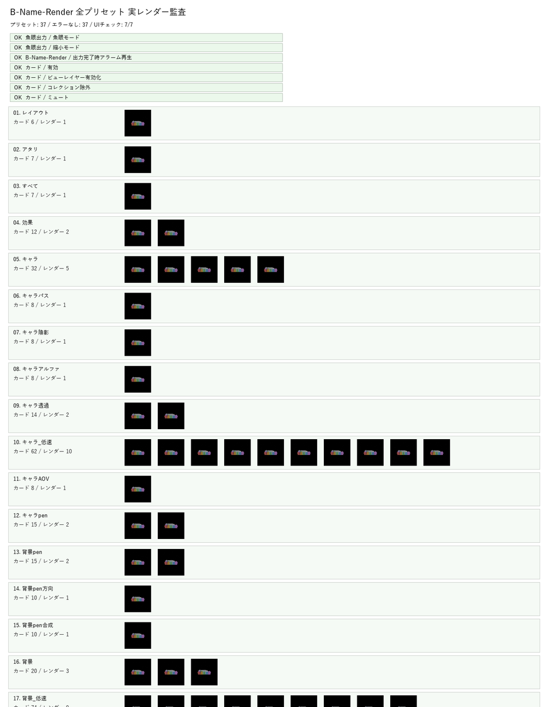

# B-Name-Render マニュアル

最終更新: 2026-05-20
対象: B-Name-Render 0.1.16 / Blender 5.1.1

## 概要

B-Name-Render は、B-Name の出力系を分離した別アドオンです。

主な役割は、コマ用blendファイルのキャラ、背景、効果、魚眼、Pencil+4 などの出力工程を、コマンド型のアクションリストとして組み立て、上から順番に実行することです。

B-Name 本体は、ページ一覧ファイルでの作画と、コマ用blendファイルでの 3D ビューポート上モデル配置を担当します。レンダー出力、魚眼レンダリング、複数パス出力は B-Name-Render を使います。

## インストールと有効化

B-Name-Render は B-Name 本体とは別アドオンです。

### 通常インストール

1. Blender を開きます。
2. プリファレンスを開きます。
3. B-Name-Render をインストールして有効化します。
4. 3D ビューのサイドバーに「B-Name-Render」タブが出ていることを確認します。

### 開発中リポジトリから使う場合

B-Name リポジトリ内の `addons/b_name_render` が B-Name-Render のアドオン本体です。開発中は、Blender の extensions フォルダ内に B-Name-Render 用のジャンクションを作り、このフォルダを直接参照させます。

B-Name 本体のリポジトリ直読み込みとは別に、B-Name-Render も個別に登録してください。

## どこから使うか

B-Name-Render は以下から使えます。

| 場所 | 表示 |
| --- | --- |
| 3D ビュー | サイドバーの「B-Name-Render」タブ |
| ノードエディター | サイドバーの「B-Name-Render」タブ |

レンダー対象のコマ用blendファイル、または出力用シーンを開いた状態で使います。

## 初回起動

初回はプリセットが空の場合があります。

1. 「B-Name-Render」タブを開きます。
2. 「プリセットがありません」と表示されたら、「初期プリセットを読み込み」を押します。
3. プリセット一覧に「キャラ」「背景」などが表示されます。

プリセット一覧右側の更新ボタンは、現在のプリセットを初期プリセットで置き換えます。自分で編集したプリセットがある場合は注意してください。

## 画面構成

### 魚眼出力

上部の「魚眼出力」では、コマ用blendファイル側で設定された魚眼状態と、B-Name-Render 側でも変更できる縮小設定を表示します。

| 項目 | 説明 |
| --- | --- |
| 魚眼モード | B-Name のコマ編集側で設定した魚眼状態を表示します。 |
| 縮小モード | 確認用に低解像度出力します。 |
| 縮小率 | 縮小モード時の出力倍率を指定します。 |
| 魚眼FOV | B-Name のコマ編集側で設定した魚眼カメラの画角を表示します。 |
| 現在の出力解像度 | 現在のレンダー解像度を表示します。 |
| 元解像度 | 縮小前などの元解像度を表示します。 |
| 出力完了アラーム | プリセット実行完了時に通知音を鳴らします。 |

魚眼出力フォルダや魚眼出力画像名は、魚眼モード時だけ有効になるコマンド設定です。

### プリセット一覧

プリセット一覧では、出力プリセットを選択・追加・削除・設定できます。

| ボタン | 説明 |
| --- | --- |
| ＋ | 新しいプリセットを追加します。 |
| － | 選択中プリセットを削除します。 |
| 設定 | プリセット設定ダイアログを開きます。 |
| 更新 | 初期プリセットを読み込み直します。 |
| プリセットを実行 | 選択中プリセットのコマンドを上から順に実行します。 |

### アクションリスト

プリセット内のコマンドは、Photoshop のアクションのように上から順番に実行されます。

| 操作 | 説明 |
| --- | --- |
| コマンドをクリック | コマンドを選択します。 |
| コマンドをダブルクリック | コマンド設定ダイアログを開きます。 |
| ＋ | 選択コマンドの下に新しいコマンドを追加します。 |
| － | 選択コマンドを削除します。 |
| 上 / 下 | 選択コマンドの実行順を入れ替えます。 |
| 選択コマンド設定 | 選択中コマンドの設定をサイドバー上で直接編集します。 |

コマンド左側のチェック状態は、そのコマンドが有効かどうかを示します。無効のコマンドは実行時にスキップされます。

## 初期プリセット

初期プリセットには、B-Name のコマ用blendファイルで使う出力プリセットと、旧出力シーン互換プリセットが含まれています。ページ一覧全体の出力は B-Name 本体のページ出力を使います。

| グループ | プリセット |
| --- | --- |
| 基本 | レイアウト、アタリ、効果、画像ノード再読み込み |
| キャラ | キャラ、キャラパス、キャラ陰影、キャラアルファ、キャラ透過、キャラ_低速、キャラAOV |
| キャラ線画 / Pencil+4 | キャラpen、キャラpen方向、キャラpen合成、キャラ線画 |
| 背景 | 背景、背景_低速、背景D、背景G、背景AO、背景線画用、背景ベース、背景パース、背景植物、背景グラデ、背景エフェクト、背景フォグ、背景雲、背景空、背景AOV |
| 背景線画 / Pencil+4 | 背景pen、背景pen方向、背景pen合成、背景線画 |
| 統合 | 効果統合、キャラ統合、背景統合 |
| 旧出力シーン互換 | 旧出力シーン互換: すべて、旧出力シーン互換: ページ |

各プリセットは、ビューレイヤー切り替え、ノード切り替え、AOV入力、出力名、レンダーなどのコマンドを組み合わせています。

## コマンドの種類

コマンドの「種類」では、実行するコマンドを選びます。

| 種類 | 用途 |
| --- | --- |
| 出力状態を退避して初期化 | 実行前のレンダー状態を退避し、プリセット用に初期化します。 |
| 出力状態を復元 | 退避した状態を戻します。プリセットの最後に置きます。 |
| ビューレイヤー | 指定したビューレイヤーを有効化します。 |
| コレクション除外 | 指定したコレクションを表示または除外します。 |
| ノードミュート | 指定したノードのミュートを切り替えます。 |
| ファイル出力切替 | 指定したファイル出力のフレームを有効 / 無効にします。 |
| AOV入力 | 指定した入力値を変更します。 |
| 出力画像名 | 出力画像名を設定します。 |
| 出力フォルダ | 出力フォルダを設定します。 |
| 画像ノード再読み込み | 画像ノードを再読み込みします。 |
| レンダー | 現在の設定でレンダーします。 |
| レンダー：ワード検出 | グループ内で検出ワードに部分一致する出力ノードだけ有効化し、他を無効化してレンダーします。 |
| 魚眼/通常レンダー | 魚眼モード時は魚眼レンダー、通常時は通常レンダーを行います。 |
| 魚眼方向/通常レンダー | 魚眼用の方向画像、または通常レンダーを行います。 |
| 魚眼合成/通常レンダー | 魚眼合成、または通常レンダーを行います。 |
| 魚眼設定 | 魚眼レンダーの設定を行います。 |
| 魚眼レンダー | 魚眼レンダーを実行します。 |
| 方向画像レンダー | 魚眼合成用の方向画像を出力します。 |
| 魚眼合成 | 方向画像から魚眼画像を合成します。 |
| Blenderオペレータ | Blender の任意のオペレータを実行します。 |

## コマンド設定

コマンドの種類によって、表示される設定項目が変わります。通常時に使わない項目はグレーアウトします。

| 設定 | 使うコマンド |
| --- | --- |
| 有効 | すべてのコマンド |
| コマンド名 | すべてのコマンド |
| 種類 | すべてのコマンド |
| ビューレイヤー / 有効化 | ビューレイヤー |
| コレクション / 除外 | コレクション除外 |
| ノード名 / ミュート | ノードミュート |
| 対象 / 検出ワード / ミュート | ファイル出力切替、レンダー：ワード検出 |
| 入力名 / 値 | AOV入力 |
| 出力画像名 | 出力画像名 |
| 出力フォルダ | 出力フォルダ |
| レンダーエンジン | レンダー系コマンド |
| サンプル数 | レンダー系コマンド |
| 魚眼出力フォルダ / 魚眼出力画像名 | 魚眼系コマンド |
| オペレータ | Blenderオペレータ |

レンダーエンジンは Cycles、EEVEE Next、Workbench から選べます。

### 名前の一致のしかた（完全一致と部分一致）

ノードを対象にするコマンドは、種類によって名前の照合方法が異なります。

- **ノードミュート**: ノードの名前またはラベルが指定文字列と**完全一致**するノードだけを対象にします（部分一致しません）。
- **ファイル出力切替 / レンダー：ワード検出**: グループ内のファイル出力ノードのうち、名前・ラベルなどに**検出ワードを含む（部分一致）**ものを対象にします。検出ワードが空のときはグループ内すべてが対象です。

## プリセットの編集方法

### 既存プリセットを編集する

1. プリセット一覧から編集したいプリセットを選びます。
2. 必要なら「設定」ボタンでプリセット名を確認します。
3. アクションリストでコマンドを選択します。
4. 「選択コマンド設定」で内容を変更します。
5. 実行順を変える場合は、コマンド右側の上 / 下ボタンを使います。
6. コマンドを追加する場合は、右側の＋ボタンを押します。
7. 不要なコマンドは右側の－ボタンで削除します。

### 新しいプリセットを作る

1. プリセット一覧右側の＋ボタンを押します。
2. プリセット名を入力します。
3. コマンド右側の＋ボタンで必要なコマンドを追加します。
4. 最初に「出力状態を退避して初期化」、最後に「出力状態を復元」を置く構成を基本にします。
5. 中間に、ビューレイヤー、ノードミュート、ファイル出力切替、レンダーなどを必要な順番で置きます。
6. 「プリセットを実行」で結果を確認します。

## 実行前に確認すること

プリセットは、シーン内のビューレイヤー、コレクション、ノード、ファイル出力フレームなどの名前を参照します。対象名が一致しない場合、そのコマンドは期待通りに動きません。

実行前に以下を確認してください。

| 確認項目 | 内容 |
| --- | --- |
| ビューレイヤー | プリセットが参照するビューレイヤー名が存在するか。 |
| コレクション | 表示 / 除外するコレクション名が存在するか。 |
| ノード | ミュート切り替え対象のノード名が存在するか。 |
| ファイル出力 | 対象と検出ワードが一致しているか。 |
| AOV入力 | 対象と入力名が一致しているか。 |
| 出力フォルダ | 保存先が存在し、書き込み可能か。 |
| カメラ | レンダーに使うカメラが正しく設定されているか。 |
| 魚眼モード | 魚眼系プリセットを使う時に魚眼モードが有効か。 |

## よく使うワークフロー

### 通常レンダー

1. 出力したいコマ用blendファイルを開きます。
2. B-Name-Render タブを開きます。
3. プリセットを選びます。
4. 「プリセットを実行」を押します。

### 魚眼レンダー

1. B-Name のコマ編集側で「魚眼モード」と「魚眼FOV」を設定します。
2. 必要に応じて「ページ画像のスケール」を B-Name のコマ編集側で設定します。
3. 確認用に軽く出す場合は B-Name-Render の「縮小モード」をオンにし、「縮小率」を設定します。
4. 魚眼系プリセット、または魚眼系コマンドを含むプリセットを選びます。
5. 「プリセットを実行」を押します。

### 確認用の低解像度出力

1. 「縮小モード」をオンにします。
2. 「縮小率」を 12.5%、25%、50% などに設定します。
3. プリセットを実行します。
4. 最終出力時は「縮小モード」をオフに戻します。

### 画像ノードを更新してから統合する

1. 「画像ノード再読み込み」プリセットを実行します。
2. キャラ統合、背景統合、効果統合などの統合プリセットを実行します。

## B-Name との連携

B-Name のページ一覧ファイルで作成したページ画像や、コマ用blendファイルの出力解像度は、B-Name-Render の出力前提になります。

コマ用blendファイル側では、ページ画像、下絵、カメラ、出力解像度を確認してください。B-Name-Render は、それらの状態を前提に、レンダー工程をコマンド順に実行します。

B-Name 管理下のコマ用blendファイルでは、出力先の既定はそのコマの `passes` フォルダになります。B-Name 本体が作るページ一覧用プレビューとは別の名前で出力します。

## 注意点

### 初期プリセットの置き換え

更新ボタンで初期プリセットを読み込み直すと、現在のプリセット一覧を置き換えます。編集済みプリセットを残したい場合は、置き換え前に内容を別名で控えてください。

### コマンドの順番

コマンドは上から順番に実行されます。レンダー前に必要な表示切り替えやノード切り替えを置き、レンダー後に状態復元を置きます。順番が違うと、別の表示状態でレンダーされる場合があります。

### 魚眼系コマンドの設定

魚眼出力フォルダと魚眼出力画像名は、魚眼モード時だけ使います。魚眼モードがオフの場合は通常レンダー側の動作になります。

### 対象名の一致

「キャラ」「背景」などの初期プリセットは、コマ用blendファイル内の出力構成に合わせた名前を参照します。旧出力シーン互換プリセットだけは、旧来のページ合成用の名前を参照します。

## トラブルシュート

### プリセットが表示されない

「初期プリセットを読み込み」を押してください。

### コマンドをダブルクリックしても設定が開かない

コマンドを一度クリックして選択し、すぐ同じコマンドをもう一度クリックします。右側の「選択コマンド設定」でも同じ内容を編集できます。プリセット設定を開きたい場合は、プリセット一覧右側の設定ボタンを使います。

### 実行しても何も変わらない

コマンドの「有効」がオンになっているか、対象のビューレイヤー、コレクション、ノード、ファイル出力フレームが実際に存在するか確認してください。

### 魚眼モードや魚眼FOVを変更したい

B-Name のコマ編集側で「魚眼モード」と「魚眼FOV」を変更してください。B-Name-Render では、出力に使う値を読み取り表示します。

### 出力解像度が想定と違う

「縮小モード」がオンになっていないか確認してください。コマ用blendファイル側の出力解像度がページ一覧ファイルの用紙設定と一致しているかも確認します。

### 出力後にシーン状態が変わったままになる

プリセットの最後に「出力状態を復元」が入っているか確認してください。独自プリセットを作る場合は、最初に「出力状態を退避して初期化」、最後に「出力状態を復元」を置く構成を基本にします。
