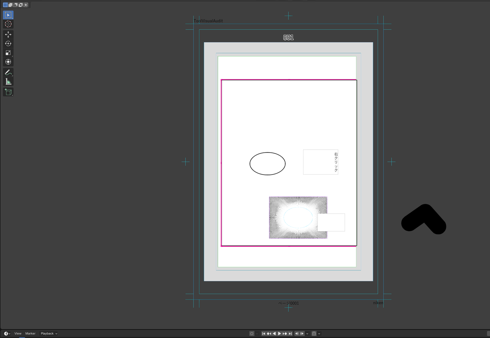
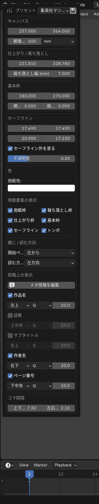
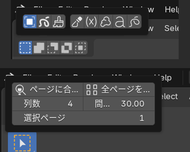
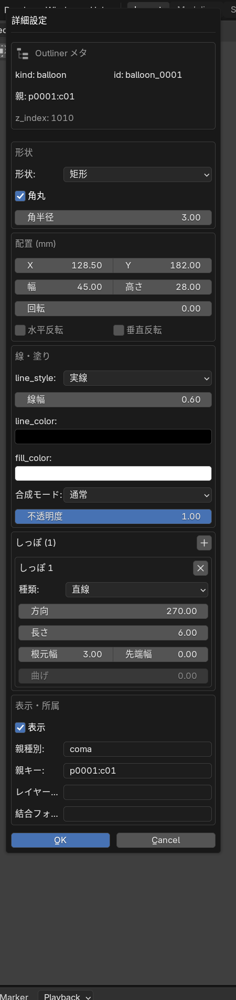
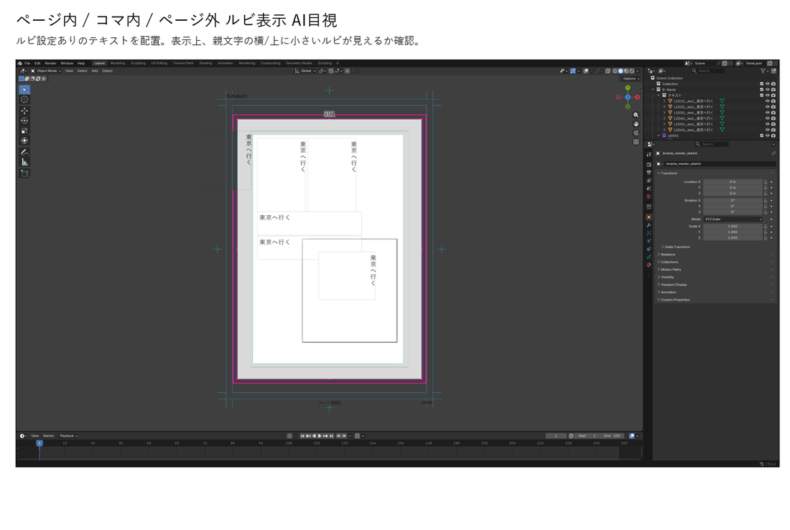
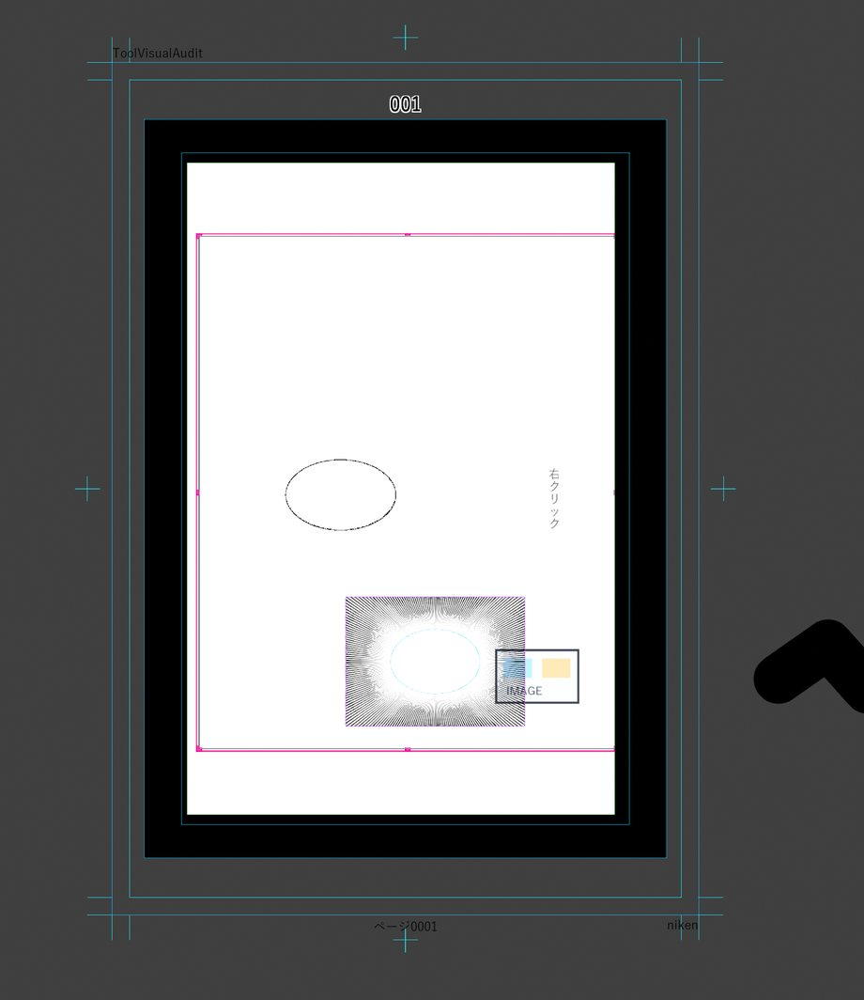
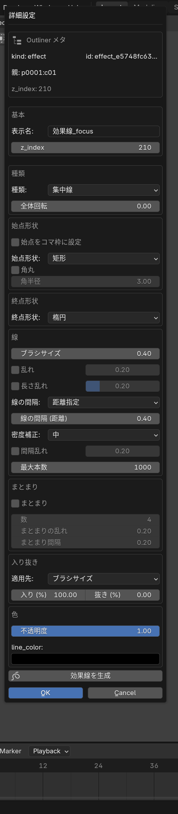
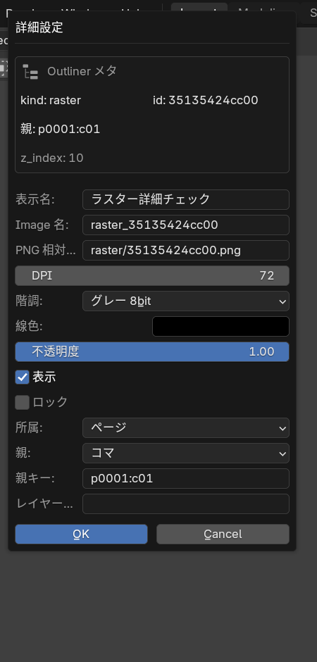
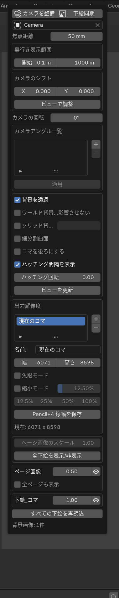

# B-Name マニュアル

最終更新: 2026-05-06
対象: B-Name 0.5.13 / Blender 5.1.1

## 概要

B-Name は、Blender 上で漫画ネーム・絵コンテを作成するためのアドオンです。

B-Name 本体の担当範囲は、ページ一覧ファイルでの作画と、コマ用blendファイルでの 3D ビューポート上のモデル配置です。魚眼レンダリング、キャラ・背景などの出力プリセット、複雑なレンダー出力は別アドオンの B-Name-Render で扱います。

B-Name 本体にも、ページ一覧ファイルから直接使う「ページ出力」は残っています。

画面例は Blender 5.1.1 実機で撮影したスクリーンショットです。B-Name タブ内の各セクションは、同じパネルを Blender のポップアップ表示で撮影したものを含みます。Blender の表示幅、テーマ、サイドバーの開閉状態によって見え方は少し変わります。

## インストールと有効化

### 通常インストール

1. Blender を開きます。
2. プリファレンスを開きます。
3. アドオン画面で B-Name をインストールして有効化します。
4. 3D ビューのサイドバーに「B-Name」タブが出ていることを確認します。

### 開発中リポジトリを直接使う場合

リポジトリを直接 Blender に読ませる場合は、Blender の extensions フォルダ内に、B-Name リポジトリへのジャンクションを作成します。これにより、修正のたびに zip 化して再インストールする必要がなくなります。

B-Name-Render は別アドオンなので、B-Name 本体とは別に `addons/b_name_render` を Blender に登録します。

## 初期設定

プリファレンスの B-Name で、以下を確認します。

| セクション | 内容 |
| --- | --- |
| ログ / デバッグ | 問題調査時のログレベルを設定します。通常は「情報」で十分です。 |
| Meldex 連携 | Meldex から受信する場合のポートを設定します。 |
| キーマップ | B-Name 専用ショートカットを有効化します。 |
| ショートカットキー | ナビゲート、オブジェクトツール、描画ツール、次/前ページのキーを変更できます。 |
| アセットライブラリ登録ガイド | 全作品共通アセットの置き場所を指定します。 |
| コマ用blendファイル | 新しいコマ用blendファイルを作るときの共通テンプレートを指定します。 |
| Grease Pencil | カーソル追従でアクティブページを切り替えるかを設定します。 |

作品ごとに別のコマ用blendファイルを使う場合は、B-Name タブの「作品」セクションにある「コマ用blendファイル (この作品のみ)」を設定します。ここが空の場合はプリファレンスの共通設定が使われます。

## 作品の作成と読み込み

3D ビューのサイドバーから「B-Name」タブを開き、「作品」セクションを使います。

| 操作 | 説明 |
| --- | --- |
| 新規 | 新しい B-Name 作品を作成します。 |
| 開く | 既存の B-Name 作品を開きます。 |
| 作品情報 | 作品名、話数、サブタイトル、作者名、開始ページ、終了ページを設定します。 |
| メタ情報を編集 | 作品情報、用紙、原稿上の表示設定をまとめて編集します。 |
| 開始ページ / 読む方向 | ページ一覧での並び順と読む方向を決めます。 |

作品を開くと、ページ一覧ファイルが表示されます。ページ一覧ファイルでは、すべてのページを俯瞰しながら、コマ、テキスト、フキダシ、効果線、ラスター、グリースペンシルを配置できます。

## 用紙設定

「用紙」セクションでは、原稿のサイズと表示要素を設定します。

| 項目 | 説明 |
| --- | --- |
| プリセット | 用紙プリセットを選択します。保存ボタンで現在の設定をプリセットとして保存できます。 |
| キャンバス | 原稿全体の幅、高さ、dpi、単位を設定します。単位変更時は値が変換されます。 |
| 仕上がり / 裁ち落とし | 仕上がりサイズと裁ち落とし幅を設定します。 |
| 基本枠 | 基本枠のサイズとオフセットを設定します。 |
| セーフライン | 天、地、ノド、小口と、セーフライン外の塗りを設定します。 |
| 色 | 用紙色を設定します。 |
| 用紙要素の表示 | 用紙枠、裁ち落とし枠、仕上がり枠、基本枠、セーフライン、トンボの表示を切り替えます。 |
| 綴じ / 読む方向 | 開始ページと読む方向を設定します。 |
| 原稿上の表示 | 作品名、話数、サブタイトル、作者名、ページ番号の表示を設定します。 |
| コマ間隔 | コマ作成時の縦横の間隔を設定します。 |

用紙要素は、編集対象のコマやテキストに隠れない補助表示として扱います。

## ビュー操作

「ビュー」セクションでは、ページ一覧の見え方を操作します。

| 操作 | 説明 |
| --- | --- |
| ページに合わせる | 選択中ページが見やすい位置へ表示を合わせます。 |
| 全ページを一覧 | すべてのページを一覧表示します。 |
| 列数 | 一覧表示時のページ列数を設定します。 |
| 間隔mm | 一覧表示時のページ間隔を設定します。 |
| 選択ページ | 数値入力でアクティブページを切り替えます。 |

コマ編集モード中は「ページ一覧に戻る」セクションからページ一覧ビューを開けます。

## ページ一覧

「ページ一覧」セクションでは、ページの追加、削除、複製、並べ替え、見開き設定を行います。

| 操作 | 説明 |
| --- | --- |
| ＋ | ページを追加します。 |
| － | 選択ページを削除します。 |
| 複製 | 選択ページを複製します。 |
| 上 / 下 | ページ順を移動します。 |
| 見開き 変更 | 選択ページを見開きにします。 |
| 見開き 解除 | 見開きを解除します。 |

ページをクリックすると、そのページがアクティブになります。コマ外かつページ内をクリックした場合も、ページを選択できます。

## ツール

「ツール」セクションには、ページ一覧で使う主要ツールが並びます。

| アイコンの役割 | 主な用途 |
| --- | --- |
| オブジェクトツール | ページ、コマ、各種レイヤーを選択・移動・編集します。 |
| Grease Pencil | グリースペンシル描画へ切り替えます。 |
| ラスター | ラスター描画へ切り替えます。 |
| 枠線カットツール | コマ枠をドラッグでカットします。 |
| レイヤー移動ツール | レイヤーをページやコマへ移動します。 |
| フキダシツール | ドラッグでフキダシを作成します。 |
| テキストツール | ドラッグでテキスト範囲を作成し、文字を入力します。 |
| 効果線ツール | ドラッグで効果線を作成します。 |

枠線選択ツールと線編集ツールは、オブジェクトツールへ統合されています。コマ枠の辺・頂点編集もオブジェクトツールで行います。

## オブジェクトツール

オブジェクトツールは、B-Name の基本編集ツールです。

| 操作 | 説明 |
| --- | --- |
| クリック | コマ、テキスト、フキダシ、効果線、ラスター、グリースペンシル、画像などを選択します。 |
| ドラッグ | 選択中の要素を移動します。 |
| 矩形ドラッグ | 範囲内のレイヤーを選択します。 |
| 右クリック | 選択中レイヤーのメニューを開きます。 |
| コマをダブルクリック | そのコマのコマ用blendファイルを開きます。 |
| コマ枠の辺・頂点をドラッグ | コマ枠の形状を編集します。 |

レイヤーを選択すると、B-Name の選択ハンドルが表示され、アウトライナー上でも対応する要素が選択状態になります。

## 右クリックメニュー

レイヤー選択中に右クリックすると、B-Name のメニューが表示されます。

| 項目 | 説明 |
| --- | --- |
| 詳細設定 | 選択中レイヤーの詳細設定ダイアログを開きます。 |
| コピー | 選択中レイヤーをコピーします。 |
| 貼り付け | コピー済みレイヤーを貼り付けます。 |
| 複製 | 選択中レイヤーを複製します。 |
| リンク複製 | 効果線をリンク複製します。 |
| しっぽをコピー | フキダシのしっぽをコピーします。 |
| しっぽを貼り付け | コピー済みのしっぽを貼り付けます。 |
| 削除 | 選択中レイヤーを削除します。 |

詳細設定ダイアログは前回開いた位置を記憶し、次回も同じ位置に表示されます。

## レイヤー

「レイヤー」セクションでは、選択ページ上のレイヤーだけをカード形式で管理します。

| 操作 | 説明 |
| --- | --- |
| ページドロップダウン | レイヤーリストの対象ページを切り替えます。 |
| レイヤーカードをクリック | レイヤーを選択します。 |
| Shift / Ctrl | 複数レイヤーを選択します。 |
| 左端の表示ボタン | レイヤーの表示 / 非表示を切り替えます。 |
| ＋ | 新規レイヤーを追加します。 |
| 複製 | 選択中レイヤーを複製します。 |
| リンク | 複数選択中のレイヤーをリンクします。 |
| － | 選択中レイヤーを削除します。 |
| 最前面 / 前面へ / 背面へ / 最背面 | 選択中レイヤーの重なり順を変更します。 |
| レイヤーカードを右クリック | そのレイヤーの詳細設定を開きます。 |

レイヤーリストには、選択ページと、そのページ上のコマ、テキスト、フキダシ、効果線、ラスター、グリースペンシル、画像、フォルダなどが表示されます。他ページのレイヤーを確認する場合は、上部のページドロップダウンで対象ページを切り替えます。各ページの重なり順は、選択中ページごとに管理されます。

## レイヤーの作成

新規レイヤーは、レイヤーリスト右側の＋ボタン、または各ツールのドラッグ操作から作成します。

| レイヤー | 作成方法 |
| --- | --- |
| グリースペンシル | レイヤーリストの＋、またはツールから描画開始します。 |
| ラスター | レイヤーリストの＋で作成し、ラスター描画へ切り替えます。 |
| フキダシ | フキダシツールでドラッグします。 |
| テキスト | テキストツールでドラッグして範囲を指定します。 |
| 効果線 | 効果線ツールでドラッグします。 |
| 画像 | 画像レイヤー追加から画像を選択します。 |
| コマ | ページ上にコマを作成し、必要に応じて枠線カットツールで分割します。 |
| フォルダ | レイヤーリスト内の整理用フォルダを作成します。 |
| 汎用フォルダ | グリースペンシル以外のレイヤーも含めて整理するフォルダを作成します。 |

フキダシ、テキスト、効果線をドラッグ作成した場合は、ドラッグ開始地点のコマまたはページの中に作成されます。ページ内かつコマ外で作成した場合は、そのページ内でコマより前面に作成されます。

## フキダシ

フキダシは、フキダシツールでドラッグして作成します。詳細設定では、線、塗り、形状、Meldex形状パラメータ、親子連動移動、しっぽを編集できます。

しっぽは複数追加できます。各しっぽでは、種類、方向、長さ、根元幅、先端幅、曲げなどを調整できます。しっぽは右クリックメニューやショートカットキーでコピー / 貼り付けできます。

フキダシがコマ内にある場合は、そのコマのマスク範囲に従って表示されます。

## テキスト

テキストは、テキストツールでドラッグして範囲を指定し、ビューポート上で直接入力します。

対応する主な設定は以下です。

| 項目 | 説明 |
| --- | --- |
| 組版 | 縦書き / 横書き、文字方向、行間、字間などを設定します。 |
| フォント・サイズ | フォントと文字サイズを設定します。サイズ単位は切り替えできます。 |
| 白フチ | 文字の白フチを設定します。 |
| ルビ・部分スタイル | ルビ、部分フォント、部分スタイル、縦中横を設定します。 |
| 親フキダシ | テキストをフキダシに紐付けます。 |
| メタ情報を編集 | テキスト内容と関連メタ情報を編集します。 |

テキストレイヤーは、B-Name 内の「テキスト」階層にまとめられ、表示上は最前面扱いになります。

## 効果線

効果線は、効果線ツールでドラッグして作成します。集中線、白抜き線、流線などの種類を扱います。

主な設定は以下です。

| 項目 | 説明 |
| --- | --- |
| 種類 | 効果線の種類を選びます。 |
| 始点をコマ枠に設定 | コマ内効果線の始点をコマ枠へ合わせます。 |
| 描画間隔 | 角度指定または距離指定で線の間隔を設定します。 |
| 線 | ブラシサイズ、乱れ、最大本数などを設定します。 |
| まとまり | 線のまとまり数とまとまり間隔、それぞれの乱れを設定します。 |
| 入り抜き | 入りと抜きの割合を設定します。初期の抜きは 0 です。 |
| 色 | 線色と不透明度を設定します。 |
| 白抜き線 | 白線と黒線の比率、太さ、減衰などを設定します。 |

「始点をコマ枠に設定」では、実際の始点と距離指定の密度計算をどちらもコマ枠に合わせます。
「始点乱れ」「終点乱れ」は、線一本ごとの実際の長さに対して、指定した割合まで線端を短くします。100%では線が消える長さまで短くなる場合があります。乱れは隣の線へ規則的に続かないように散らされます。

## ラスターと Grease Pencil

ラスターと Grease Pencil は、ツールセクションからいつでも選択できます。

| 操作 | 説明 |
| --- | --- |
| Grease Pencil | グリースペンシル描画へ切り替えます。 |
| ラスター | ラスター描画へ切り替えます。 |
| 別ツールへ切り替え | 直前の描画モードを終了します。 |
| Ctrl + Alt + ドラッグ | ブラシサイズを調整します。 |
| Space | 描画中もビュー操作に使えます。 |

ラスターはページまたはコマに合わせた描画面として扱われます。透明部分は透過表示され、コマ内にある場合はコマのマスク範囲に従って表示されます。

## レイヤーの移動と階層変更

レイヤーは、ページ内、コマ内、ページ外へ移動できます。

| 操作 | 説明 |
| --- | --- |
| Alt + ドラッグ | ドロップ先のページまたはコマへレイヤーを入れます。ページ外へドロップすると外へ出します。 |
| Alt + クリック | 位置を動かさず、クリック地点の下階層へ移動します。 |
| Alt + Shift + クリック | 位置を動かさず、クリック地点の上階層へ移動します。 |

Alt 操作中はドロップインジケーターが表示されます。

## コマ用blendファイル

コマをダブルクリックすると、そのコマのコマ用blendファイルを開きます。

コマ用blendファイルでは、3D ビューポート上でモデルや小物を配置し、ページ一覧へ戻った時にコマのプレビューへ反映します。

### コマ編集: カメラ

コマ用blendファイルを開くと、「コマ編集: カメラ」セクションを使えます。

| 操作 | 説明 |
| --- | --- |
| カメラを整備 | コマ編集用カメラを用意します。 |
| 下絵同期 | ページ一覧側の情報をページ画像・下絵として同期します。 |
| 焦点距離 / 魚眼FOV | 通常カメラまたは魚眼カメラの見え方を調整します。 |
| 奥行き表示範囲 | カメラの開始・終了クリップを設定します。 |
| カメラのシフト | カメラシフトを数値またはビュー上で調整します。 |
| カメラアングル一覧 | よく使うカメラアングルを追加・削除・適用します。 |
| 出力解像度 | ページ一覧の用紙設定と一致する解像度を管理します。 |
| ページ画像 | ページ一覧側で作成された画像の表示不透明度を設定します。 |
| ページ画像のスケール | 魚眼モード時のページ画像スケールを調整します。 |
| 下絵_コマ | 他コマなどの下絵表示を切り替えます。 |
| すべての下絵を再読込 | 参照画像を再読み込みします。 |

ページ画像では、編集中のコマの背景だけが透明になり、ページ一覧側の枠線、ラスター、グリースペンシル、テキスト、フキダシ、効果線などは参照表示されます。

### ページ一覧に戻る

コマ用blendファイルから戻る場合は、「ページ一覧に戻る」セクションの「ページ一覧に戻る」を使います。必要に応じて「ページ一覧ビューを開く」も使えます。

## ページ出力

B-Name 本体の「ページ出力」セクションでは、ページ一覧ファイルの基本出力を行います。

| 操作 | 説明 |
| --- | --- |
| 現在のページを書き出し | 選択中ページを書き出します。出力サイズを%で指定できます。 |
| 指定範囲を書き出し | 開始ページと終了ページを指定し、その範囲だけを書き出します。出力サイズを%で指定できます。 |
| PDF 結合書き出し | 指定範囲のページを PDF としてまとめます。出力サイズを%で指定できます。 |

キャラ、背景、魚眼、Pencil+4、複数パスなどのレンダー出力は B-Name-Render を使います。

## Outliner レイヤー

「Outliner レイヤー」セクションでは、Blender のアウトライナー表示と B-Name の整合性を管理します。

| 操作 | 説明 |
| --- | --- |
| B-Name 表示へ | アウトライナーを B-Name 編集向け表示にします。 |
| 復元 | アウトライナー表示を戻します。 |
| オーバーレイ表示 | B-Name の選択枠やハンドルなどの補助表示を切り替えます。 |
| 全マスクを再生成 | ページ / コマのマスクを再作成します。 |
| 孤立マスクを削除 | 不要になったマスクを削除します。 |
| B-Name 階層を修復 | レイヤー階層の整合性を修復します。 |
| コマ ID を順番通り再採番 | 選択ページのコマ ID を順に振り直します。 |

## ショートカット

既定の主なショートカットは以下です。プリファレンスで一部変更できます。

| ショートカット | 動作 |
| --- | --- |
| Space + ドラッグ | パン |
| Shift + Space + ドラッグ | 回転 |
| Ctrl + Space + ドラッグ | ズーム |
| Space + ダブルクリック | 表示位置リセット + ページに合わせる |
| Shift + Space + ダブルクリック | 回転リセット |
| O | オブジェクトツール |
| P | 描画ツール |
| F | 枠線カットツール |
| K | レイヤー移動ツール |
| T | テキストツール |
| COMMA | 次のページ |
| PERIOD | 前のページ |
| Z | 戻る |
| X | 進む |
| E | 消しゴム切替 |
| C | 描画中のブラシシェルフ表示切替 |
| Esc | コマ用blendファイルからページ一覧へ戻る |
| Ctrl + ホイール | 1ステップズーム |
| Ctrl + Shift + クリック | レイヤー選択 |
| Ctrl + C | レイヤーをコピー |
| Ctrl + V | レイヤーを貼り付け |
| Ctrl + Shift + C | フキダシのしっぽをコピー |
| Ctrl + Shift + V | フキダシのしっぽを貼り付け |
| Ctrl + Alt + ドラッグ | ブラシサイズ調整 |

## よくある確認事項

### 最新版が反映されない

開発中リポジトリを直接読ませている場合でも、Blender 側でアドオンを再読み込みするか、Blender を再起動してください。プリファレンスのアドオン一覧で表示されるバージョンも確認します。

### コマをダブルクリックしても開かない

プリファレンスの「コマ用blendファイル (全作品共通)」または作品セクションの「コマ用blendファイル (この作品のみ)」が設定されているか確認してください。

### レイヤーがコマ外にはみ出して見える

「Outliner レイヤー」セクションで「全マスクを再生成」を実行してください。コマ形状を大きく変更した直後も、必要に応じて再生成します。

### ページ一覧の表示が崩れた

「ビュー」の「全ページを一覧」または「ページに合わせる」を実行します。アウトライナー表示が崩れた場合は「Outliner レイヤー」の「B-Name 表示へ」または「復元」を使います。

### アドオンを無効にした時の見え方

枠線、テキスト、フキダシ、効果線、ラスター、グリースペンシルなどの作品要素は、Blender 上の実体として残る方針です。選択枠やハンドルなどの編集補助表示は、B-Name のオーバーレイとして表示されます。
