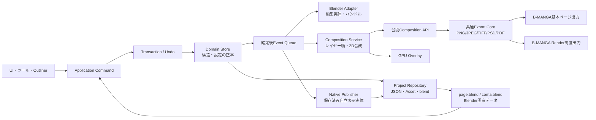

# B-MANGA 全体リファクタリング・安定版認定計画

作成日: 2026-07-28
セッション種別: 開発
状態: **Phase 0〜3合格。Phase 0〜2個別コミット完了、Phase 3個別コミット準備完了。次はPhase 4**
対象: B-MANGA / B-MANGA Render / B-MANGA Line
基準環境: **Blender 5.2 LTS のみ**

---

## 1. 結論

B-MANGAは、個別不具合を直し続ける前に、全体の目標構造を決めたうえで段階的にリファクタリングするべき状態にある。

ただし、全面書き直しを一度に行う「ビッグバン方式」は採用しない。新しい正本と共通基盤を先に作り、機能を縦に一つずつ移し、その機能の旧経路を同じ段階で削除する。各段階は、決定的テストと実機確認を通過するまで次へ進めない。

今回の追加前提により、次は不要とする。

- 既存作品ファイルを新形式へ変換する機能
- 旧保存形式を読み続けるフォールバック
- 旧PropertyGroup、旧ID、旧Object構造の互換分岐
- Blender 5.1以前および4.x向けAPI互換分岐
- 旧版と新版を同じ作品内で往復する保証

一方、次は後方互換とは別の安全要件なので必ず残す。

- 保存途中の失敗・強制終了・ディスク容量不足からの復旧
- ファイル切替失敗時のメモリ状態と画面状態のロールバック
- Undo / Redo
- 複数Blender画面で同じ作品を開いた場合の競合検知
- 書き出し途中失敗時の欠落検知と失敗状態の明示
- テスト用作品や設定を壊す操作の事前退避

「安定版」の合格条件は、既知不具合ゼロという台帳上の状態だけではない。B-MANGAが提供する全機能、全詳細設定項目、全形状、全線種、保存・再読込、PSD・JPEG等の最終成果物まで、途中でコードやデータを修理せず一連の作業を完了できることを実証した状態とする。

---

## 2. 今回確定した前提

### 2.1 互換性

- ユーザーはまだ実際の作品制作を開始していない。
- 既存の開発用・検証用作品は新形式へ自動変換しない。
- 新版では新規作品を作り直す。
- 個人プリセット、作業設定、旧キャッシュも旧形式の自動取込対象にしない。必要な見た目は新形式の既定プリセットまたは新規作成したプリセットとして固定する。
- 旧形式を検出した場合は、曖昧に読み込まず「この形式は対象外」と明示して停止する。
- 互換コードを「念のため」に残さない。
- このクリーンブレークは、実作品がまだない現時点の一回だけとする。新形式の安定版で制作を開始した後は、schema変更時の移行、退避、復旧、旧作品読込をリリース必須条件へ戻す。

### 2.2 Blender

- 実装、API選択、manifest、単体検査、実機検査、画面目視、性能計測はBlender 5.2 LTSを唯一の基準とする。
- `blender_version_min = "5.2.0"` を維持する。
- Windows実機テストは`C:\Program Files\Blender Foundation\Blender 5.2\blender.exe`を標準実行ファイルとする。
- Geometry Nodes、Grease Pencil、EEVEE、コンポジター、Extension APIは5.2 LTSの正式経路だけを使う。
- 5.1以前のソケット名、Grease Pencil世代、レンダーエンジン名等の互換分岐を削除対象にする。

### 2.3 製品範囲

安定版認定の対象は「主要機能」だけではなく、画面から利用できる全機能とする。少なくとも次を含む。

- 作品作成、作品情報、用紙、ページ、見開き、ページ一覧
- 作品ファイル、ページファイル、コマファイルの作成・保存・遷移
- コマ作成、分割、結合、辺・頂点編集、枠線、フチ、マスク、3Dコマ
- レイヤー、フォルダー、並び順、リンク、複製、移動、ページ間移送
- オブジェクト、レイヤー移動、自由変形、回転、スナップ、選択、ハンドル
- テキスト、縦書き、横書き、IME、キャレット、範囲選択、ルビ、縦中横、部分書式
- フキダシ、しっぽ、結合、全形状、全線種、フチ、多重線、パス線
- 効果線、集中線、ウニフラ、ベタフラ、流線、白抜き線、パス
- GP、画像、ラスター、囲い塗り、グラデーション、パターンカーブ
- プリセット、詳細設定ダイアログ、右クリック、Outliner、ショートカット
- 作品情報、ノンブル、用紙ガイド、ページプレビュー、2D合成表示
- Meldex受信、アセットブラウザ、設定の保存
- B-MANGA Renderの全コマンド、魚眼、AOV、レンダー、完成画像出力
- B-MANGA Lineの全線種、表示、最適化、修復、AOV・コンポジター連携
- PNG、JPEG、TIFF、PSD、PDFの単一・複数・見開き書き出しと外部再読込

---

## 3. 調査結果

### 3.1 規模

調査時点の概算は次のとおり。

| 対象 | 件数 |
|---|---:|
| 製品側Python | 約493ファイル / 約22.1万行 |
| テスト側Python | 444ファイル / 約12.8万行 |
| `blender_*_check.py` | 381本 |
| 現行AI監査ランナーへ明示登録されたケース | 38件 |
| 1000行超のPython | 56ファイル |
| 1500行超のPython | 26ファイル |
| `core/` のBlenderプロパティ宣言 | 約901件 |
| 専用の旧形式・作品変換モジュール | 約3970行 |
| `io/schema.py` 内の存在確認フォールバック | 122箇所 |

現行テストの本数は多いが、一つの認定ランナーが全件を把握しているわけではない。大量の個別テストが存在することと、全機能が常に認定されることは同義ではない。

### 3.2 巨大責務の集中

特に次のファイルへ複数責務が集中している。

- `utils/balloon_line_mesh.py`
- `utils/layer_stack.py`
- `utils/geometry_nodes_bridge.py`
- `operators/object_tool_op.py`
- `operators/coma_edge_move_op.py`
- `io/export_pipeline.py`
- `ui/overlay.py`
- `utils/balloon_curve_object.py`
- `io/schema.py`
- `io/export_balloon.py`
- `utils/handlers.py`
- `utils/layer_object_sync.py`

問題は行数そのものだけではない。一つの設定変更が、PropertyGroup、詳細UI、プリセット、JSON、Object custom property、キャッシュ署名、ビューポート生成、書き出しへ分散しており、ある経路だけ更新漏れになりやすい。

### 3.3 構造的な再発原因

| 構造上の問題 | 現在確認できる症状・危険 |
|---|---|
| JSON、PropertyGroup、Object/Collection、custom property、GPUキャッシュが相互に書き戻す | どれが最新かが操作時期によって変わり、保存・画面・Outlinerが食い違う |
| load/save/depsgraph/timer/undo処理が複数モジュールに分散 | 抑止フラグと世代番号の組合せが増え、再入・古い遅延処理・遷移後実行が起きやすい |
| 設定項目が複数の手書きリストに重複 | UIにはあるが保存されない、プリセットだけ欠ける、キャッシュが無効化されない、書き出しに出ない |
| ビューポートと書き出しが別の描画入口を持つ | 画面とPNG/PSDで形状、位置、線、重なり順がずれる |
| オブジェクトツール、レイヤー移動、Alt移送、自由変形が別々のセッション状態を持つ | ハンドル追従、Alt途中押下、リンク閉包、キャンセル、Undoの挙動が揃わない |
| 本体とB-MANGA Renderに出力入口・設定・実行責務が残る | 同じページ出力でも経路と失敗処理が違う |
| テスト入口が分裂し、条件不足を成功扱いできる | 「full」が通ってもPSD/JPEGや全設定が未実行になり得る |
| 大量の例外握りつぶし | データ同期や保存が一部失敗しても、別処理が続き不整合を固定化し得る |
| 不要な旧形式変換・互換分岐 | 現在形式の保存・読込にも分岐と副作用を持ち込み、検証面を広げる |

### 3.4 コード上で再確認した具体例

以下は推測ではなく、現行コードの経路から成立を確認した。

- ページ遷移は、新しいページの`active_page_index`を先に設定してから、現在ページの保存と次ページのopenを行う。途中失敗時に旧indexへ戻す共通処理がない。
- Outliner D&Dの親変更書き戻しは対応kindが限定され、フキダシ等が共通経路から外れる。
- 保存前のObject→PropertyGroup書き戻しは、失敗をログに残してもJSON保存を続ける経路がある。
- 保存前ハンドラは、可視性、カメラ、マスク、Object書き戻し、JSON、Outliner mirror等を一度に扱う。
- Object書き戻しはdepsgraph、定期timer、保存直前の複数経路に存在する。
- 全ページ書き出しは、一部ページが失敗してもエラー件数を表示して`FINISHED`を返す。
- PDFは一部ページの生成に失敗しても、残ったページだけでPDFを作れる。
- 現在ページ書き出しとページファイルからの書き出しに、ほぼ同じ設定と保存処理が重複する。

### 3.5 コマ・テキスト・フキダシ・効果線

詳細設定UIの入口統合は進んでいるが、設定の正本と描画の正本はまだ統一されていない。

| 機能 | 現状と不足 |
|---|---|
| コマ | 4形状、5枠線種、3角種、3フチ位置を持つが、実体生成と書き出しが別入口で、自由形状・曲線・ぼかし・内外フチの画素同値認定が不足 |
| テキスト | 縦横、Q/pt、太字、斜体、フチ、ルビ、部分フォント・書式、縦中横を持つが、Pillow表示と書き出しが別入口で、IMEからPNG/PSDまでの一貫認定が不足 |
| フキダシ | 8形状、10線種、3しっぽ形状、動的形状、多重線、内外フチ、白抜き、ウニフラ、各パス線を持つが、Curve/Meshと書き出し、結合形状に重複描画経路が残る |
| 効果線 | 5種類、6端形状、間隔、房、入り抜き、下地、白抜き、各パスを持ち、Object metadataとGeometry Nodes依存が強い一方、表示実体と書き出しMeshの種類別同値認定が不足 |

### 3.6 書き出し

- 紙、画像、塗り、ラスター、コマ、効果線、GP、フキダシ、テキスト、トンボ、作品情報、ノンブルを扱う基盤は存在する。
- PSDのレイヤー・グループマスク経路も存在する。
- しかし、全書き出し形式を標準監査へ必須登録していない。
- 保存後に別ライブラリで再読込し、寸法、DPI、色、ページ数、PSDレイヤー、マスク、順序を検証する共通契約がない。
- 実作品相当のPNG/JPEG/TIFF/PDF/PSD golden一式がない。

---

## 4. 目標アーキテクチャ

### 4.1 全体像



原則は「一つの操作につき、一つのCommand、一つのTransaction、一度の確定Event」である。

### 4.2 データの所有権

| データ | 正本 | 派生物 |
|---|---|---|
| 作品情報、用紙、ページ順、見開き | `project.json` | UI表示、ページ一覧overlay |
| レイヤー階層、リンク、設定、位置、順序 | 各`page.json`のDomain Model | PropertyGroup投影、Object custom property、Outliner名、Z値 |
| GP、Curve/Mesh、文字・画像data、transform、material、visibility、modifier等の標準編集 | `page.blend`内のUID付き編集実体 | Domain参照、2D合成、書き出し |
| テキスト・フキダシ・効果線等の保存時表示 | 共通Primitiveからcheckpoint時に作るNative Snapshot | アドオン無効時にも表示・レンダリングできる保存済み実体 |
| 3Dコマ内容 | 各コマの`scene.blend` | コマプレビュー、最終レンダー |
| ラスター画素・参照画像 | UID付き外部asset | Blender Image、GPU texture |
| ページプレビュー・合成画像 | cache | GPU overlay |
| 選択、ホバー、ドラッグ中位置、ダイアログ一時値 | Session State | 画面表示のみ |
| ユーザープリセット | 新形式のPreset Store | ダイアログ一時値 |

JSON、PropertyGroup、Objectの全てを同格の正本にはしない。構造・B-MANGA設定はDomain、Blender標準で直接編集できるUID付き作品ObjectとdataはNative Dataを正本とし、transform、geometry、text/image data、material、visibility、modifier等の所有権をfield単位で固定する。

PropertyGroupはBlender UI用の投影とする。UI操作で値が変わった場合も、PropertyGroupから任意モジュールへ直接副作用を起こさず、共通Commandへ変換してDomain Storeを更新し、確定後に必要な投影だけを更新する。

Native Publisherは前回publish hashと現在値をObject、data、material、modifierまで比較する。表現可能な変更はChange CollectorからDomainへ取り込み、表現不能な変更は`native_override`として以後の再生成対象から外し、明示的な「再生成」確認なしに戻さない。ページ一覧previewとGPU cacheはoverlay専用だが、作品内容のNative Snapshotとは区別する。

### 4.3 新しい保存形式

旧形式を引き継がないため、構造を新規に固定する。

```text
<work>.bmanga/
  project.json
  pages/
    <page_uid>/
      page.json
      page.blend
      assets/
      comas/
        <coma_uid>/
          scene.blend
          preview.png
  presets/
  cache/
  journal/
```

- `project.json`と`page.json`は新しいschema versionだけを受け付ける。
- 表示ページ番号、コマ番号、名称と内部UIDを分離する。
- ページ並べ替えやコマ再採番でファイルパスと参照IDを変更しない。
- 親子関係とリンクはUIDだけで表す。
- 並び順は親が持つ子UID配列を正とし、各ObjectのZ値やindexは派生値にする。
- cacheは全削除しても再構築できる。
- 旧`work.json`、`pages.json`、旧`page.json`、旧custom propertyからの自動変換は作らない。
- 新形式の最初の正式版をschema v1として固定し、その後のschema更新は一方向で冪等なmigrationと自動退避を必須にする。

### 4.4 CommandとTransaction

全てのユーザー操作を次の形へ揃える。

```text
begin
  対象UID・開始状態・関連閉包・変更予定assetを取得
update
  Session Stateとoverlayだけを更新
validate
  ID、親子、リンク、範囲、書込可否を検証
commit
  Domain更新 → dirty記録 → event発行
checkpoint
  保存・ファイル遷移・ページ間移送など必要な時だけrepositoryを原子的に確定
rollback
  メモリ、Blender実体、JSON、asset、選択状態を開始時へ戻す
```

スライダー操作、文字入力、ドラッグ中更新のたびにディスクへ書かない。同一UI操作中の連続更新は一つのCommandへまとめ、確定後に一度だけdirty eventを出す。通常の編集Commandはメモリ内のUndo対象、保存・別ファイルへ影響する操作だけをdurable transactionとする。

複数ファイルの同時確定では、Windows上の複数`os.replace`を一括原子操作だと仮定しない。`PREPARED`、`NATIVE_SAVED`、`COMMITTED`を記録するwrite-ahead journal、同一ディレクトリの一時ファイル、hash検証、起動時の冪等recoveryを使う。JSONだけ新しくblendだけ古い状態、またはその逆を正常状態として残さない。

復旧契約を混同しない。

| 境界 | 復旧方法 |
|---|---|
| ダイアログ・ドラッグ・通常Commandのキャンセル | 同じBlender Main内のメモリsnapshotとUndoで開始時へ戻す |
| checkpoint準備・保存失敗 | `open_mainfile`を呼ぶ前に中止し、現在Mainを維持する |
| source checkpoint成功後のtarget open失敗 | 保存済みsource generationを再openし、DomainとSessionをhydrateし直す |
| `open_mainfile`後 | 破棄された未保存RNAをメモリrollbackできるとは扱わない。必ずopen前checkpointを完了させる |
| Blender/OS強制終了 | 次回起動時にjournalとcommit manifestをreplayし、最後の完全generationへ収束させる |

checkpoint前に、staging、元ファイル退避、最終generationを同時に保持できる空き容量を検査する。容量不足を検出してから元ファイルを書き換えない。

適用対象:

- プロパティ変更
- 詳細ダイアログOK / キャンセル
- プリセット適用
- レイヤー並べ替え
- オブジェクト・レイヤードラッグ
- Altによるコマ・ページ間移送
- リンク・リンク複製
- ページ・コマ追加、削除、結合、分割
- 保存、名前を付けて保存
- Meldex取込
- 書き出し

Transaction外でJSON、asset、親UID、リンクUIDを直接変更することを禁止する。

### 4.5 ファイル遷移Coordinator

作品、ページ、コマの遷移を単一の状態機械へ集約する。

状態:

```text
STABLE
→ PREPARING
→ SAVING_SOURCE
→ OPENING_TARGET
→ HYDRATING
→ STABLE
```

失敗時:

```text
任意状態
→ ROLLING_BACK
→ 最後の完全checkpointを再hydrateしたSTABLE
```

規則:

- `active_page_uid`等は対象ファイルのopenとhydrate成功後に確定する。
- handlerは重い同期を実行せず、型付きEventをCoordinatorへ渡すだけにする。
- timerは一つのSchedulerが所有する。
- 世代tokenが変わった遅延処理は実行前に破棄する。
- save前に全Objectを走査して正本へ戻す設計を廃止する。
- Ctrl+S、ページ遷移、コマ遷移、作品を閉じる操作は同じ`checkpoint()`を呼び、dirtyなDomainとBlender固有データだけを保存する。
- Object/Outlinerの直接編集は一つのChange Collectorが差分をCommandへ変換する。
- save、load、undo、redo、register、unregisterの順序を一つのテスト可能な状態機械として扱う。
- 作品ごとにsession ID、基準revision、内容hashを持ち、別Blenderプロセスが先に確定していた場合は上書きせず競合として停止する。

### 4.6 設定Schema Registry

各ユーザー向け設定を一度だけ宣言する`FieldSpec`を導入する。

各FieldSpecが持つ情報:

- 安定field ID
- ユーザー向け名称・説明
- 型
- UI単位と内部単位
- 既定値
- min / max / soft range
- enum値
- 適用対象
- 表示・有効条件
- JSON保存対象か
- プリセット保存対象か
- Undo対象か
- 変更時に汚すcache種別
- 再生成対象
- 合成・書き出しへの影響
- 自動生成するテストケース

同じRegistryから次を作る。

- Blender Property
- 詳細設定UI
- プリセットsnapshot / apply
- JSON codec
- cache signature
- dirty通知
- 入力値検証
- テストマトリクス

複雑なルビspan、カーブ、ポイント列等は専用codecを使うが、登録自体はRegistryへ残す。

### 4.7 Feature単位の構成

機能ごとに次の責務を同じディレクトリへまとめる。

```text
features/<feature>/
  schema.py
  commands.py
  geometry.py
  composition.py
  blender_adapter.py
  ui.py
  presets.py
  tests/
```

候補feature:

- project / paper / page / spread
- coma / mask / camera
- text / typography
- balloon / tail
- effect
- gp
- raster
- image
- fill / gradient
- image_path
- layer / folder / link
- meldex
- render_integration
- liner_settings / liner_generation / liner_mesh_operations

番号で分割した`.part01.py`等は作らない。巨大ファイルは、線生成、offset、triangulation、material、cache、Blender Object adapter等の責務で分割する。

### 4.8 共通Composition

ビューポートと完成画像は同じ中間表現を使う。

```text
Domain Layer
＋ UID付きNative Geometry
→ Feature Compiler
→ RenderPrimitive / Mask / Group
→ LayerOrder
→ Composite
→ GPU overlay / Native Publisher / Export writer
```

要件:

- レイヤー一覧順を唯一の重なり順とする。
- コママスク、フォルダー、opacity、blend modeを共通適用する。
- コマ、テキスト、フキダシ、効果線の形状・線生成を画面と書き出しで二重実装しない。
- 2D合成プレビューとPNGの同DPI結果を画素一致させる。
- PSD平坦化結果も同じ合成結果と一致させる。
- JPEGは不可逆圧縮なので許容誤差を明示する。
- 編集中だけ、背面合成・編集実体・前面合成の三層表示を使う。
- プレビュー用Object、Mesh、Material、CollectionをOutlinerへ保存しない。
- checkpoint時にdirtyな作品内容だけをNative Snapshotへ反映し、アドオンを無効にした保存済みblendでも作品が消えずレンダリングできるようにする。
- 効果線のGeometry Nodes依存は、編集入力として必要な部分と最終描画を分離し、最終表示・出力は共通Primitiveへ収束させる。

### 4.9 Interaction Kernel

次を共通化する。

- 画面座標→世界座標→ページローカル座標
- 現在ページだけを対象とする選択gate
- レイヤー種別ごとの実形状hit test
- 同一点の候補列挙とクリック循環
- 選択名の一時表示
- ハンドル描画とhit test
- hover
- 通常ドラッグ
- Alt途中押下による親・ページ移送への切替
- 回転、自由変形
- cancel、confirm、Undo
- 複数選択、子孫閉包、リンク閉包

オブジェクトツール、レイヤー移動ツール、Alt移送が同じ`DragSession`と`TransferGroup`を使う。MOUSEMOVE中はSession Stateとoverlayだけを動かし、正式データはcommit時に一度だけ変更する。

### 4.10 Exportの責務

- B-MANGA本体は、Domain、Composition、共通Export Coreの公開APIを提供する。
- Export Coreの物理ソースは本体の`export_core/`だけに置き、Renderへ複製しない。本体はregister時とpersistent `load_post`で、ファイル読込ごとに消える`bpy.app.driver_namespace["BMANGA_EXPORT_CORE_V1"]`へowner token付きserviceを再登録する。Renderは各job開始時にこの固定keyだけを遅延再取得し、内部module探索をしない。
- 「現在のページ」「全ページ」「PDF」の基本ページ出力UIは、現行の仕様正本どおりB-MANGA本体に残す。
- B-MANGA Renderは魚眼、AOV、Pencil+4、eeVR、カード型出力プリセット等の高度な実行を担当し、基本ページ出力と同じExport Coreを呼ぶ。
- UI入口は複数でも、生成・保存・検証の実装はExport Coreだけにする。
- B-MANGA、Render、LineはAPI versionとcapabilityを起動時に照合し、不一致の組合せを有効化しない。同じrelease trainで認定する。
- unregisterはRenderがjobを停止してservice参照を外した後、本体がowner token一致時だけserviceを除去する。未導入・不一致・解除中は高度出力UIを理由付きで無効化する。
- B-MANGA本体とRenderに重複する書き出し実装を削除し、入口だけを薄いadapterとして残す。
- 単一ページ、全ページ、見開き分割、現在コマ、PDF、PSDを共通`ExportRequest`へ揃える。
- 戻り値は`ExportResult`とし、生成予定件数、成功件数、成果物一覧、警告、失敗を構造化する。
- 一括出力は失敗ページを記録して残りを続行できるが、最終状態を`PARTIAL_FAILURE`とし、欠落があるのに「書き出し完了」や`FINISHED`を返さない。成功済み成果物、失敗一覧、再試行対象を明示する。
- 保存後に成果物を再読込し、期待契約を満たすまで成功扱いにしない。
- 仕様正本が要求するモノクロ、グレースケール、RGB、CMYKを形式ごとに実装・認定する。技術的に提供しない組合せが出た場合は、安定版認定前にユーザーの明示承認で仕様範囲を変更し、UIと`ExportRequest` validationの両方で選択不能にする。

### 4.11 例外と観測

- データ、保存、遷移、書き出し経路で`except: pass`を禁止する。
- 例外は、回復済み、ユーザーへ通知して中止、上位へ再送出、のいずれかに分類する。
- `Operation ID`、対象UID、Transaction phase、dirty理由、cache hit/miss、処理時間を構造化ログへ出す。
- 1操作につき、再同期回数、全件走査回数、画像再生成回数、GPU転送回数をテストから取得できるようにする。
- 性能改善は機能や画質を削るのではなく、同じ操作内の重複処理をゼロへ近づける。

---

## 5. 全機能テスト基盤

### 5.1 Feature Contract Catalog

Phase 0では現行RNAとソースから、全Operator、全Panel、全Property、全プリセット、全ショートカット、全書き出し形式を機械抽出し、暫定field IDと一意な機能IDを付ける。Phase 2でFieldSpecへ正規化した後も同じIDを維持する。

各機能IDに次を紐付ける。

- 到達するUI
- 前提ファイル種別
- 入力
- 正常結果
- キャンセル結果
- Undo / Redo
- 保存・再読込
- 画面期待値
- 出力期待値
- 性能計測点
- 対応テストID

カタログに未テスト機能が一つでもあれば、安定版認定を開始しない。

### 5.2 設定マトリクス

全数値の無限組合せを総当たりすることはできないため、次の規則で漏れなく検査する。

- 全enum値を最低1回使用する。
- 全boolをON/OFFで検査する。
- 全数値をmin、既定値、代表中間値、max、境界外拒否で検査する。
- 全条件表示項目について、表示条件の直前・成立・解除を検査する。
- 単位変換はUI値→内部値→保存→再読込→UI値の往復で検査する。
- 色はsRGB UI値とscene-linear内部値の往復を検査する。
- seedを持つ形状は同seed同値、別seed差分を検査する。
- 有効な全二項組合せをpairwise生成する。
- 不具合が集中する組合せは直積で全件検査する。

必須の直積群:

- コマ形状 × 枠線種 × 角種 × フチ位置
- テキスト縦横 × Q/pt × ルビ種類 × ルビ配置 × 小書き × 縦中横
- フキダシ8形状 × 10線種
- フキダシ動的形状 × 尖角方式 × 谷山線幅 × 多重線 × 内外フチ
- フキダシ線種 × しっぽ形状 × 結合有無
- 効果線5種類 × 外端6形状 × 内端6形状
- 効果線種類 × パスsource × stamp/ribbon × 入り抜き
- 各レイヤー種別 × 親がページ/コマ/フォルダー × リンク有無
- 各レイヤー種別 × opacity × blend mode × 前後関係

### 5.3 テスト層

1. **Pure unit**
   - BlenderをimportしないDomain、ID、順序、単位変換、geometry、codec、transaction。
2. **Repository integration**
   - JSON、asset、journal、失敗注入、ロールバック、再読込。
3. **Blender headless**
   - register、Property投影、Object adapter、GP、Geometry Nodes、保存・open、Undo/Redo。
4. **Blender UI E2E**
   - 実クリック、ドラッグ、Alt途中押下、IME、キャレット、ダイアログ、Outliner、ショートカット。
5. **Visual golden**
   - 3D View screenshot、2D合成、PNG、PSD平坦化。
6. **Artifact validation**
   - JPEG/TIFF/PNG/PDF/PSDを別ライブラリで再読込し、外部成果物として検査。利用可能な環境ではPSDをClip Studio PaintまたはPhotoshop等の独立した実アプリでも開く。
7. **Performance**
   - フレーム時間、全件走査回数、open時間、再生成回数、メモリ上限。
8. **Soak / fault injection**
   - 連続操作、連続Undo/Redo、ページ往復、保存中例外、強制終了、容量不足、同時編集。

### 5.4 Fixture

リポジトリ内で決定的に生成する。

- 最小1ページ
- 左右見開き
- 全レイヤー種別1個ずつ
- 全詳細設定を分割配置した設定マトリクス作品
- リンクと入れ子を含む作品
- 55ページ、80ページの重量作品
- 日本語・空白・記号・長いパスを含む保存先
- 欠損asset、読取専用、容量不足を模した失敗fixture
- B-MANGA RenderとLineを同時有効化したfixture

Dropboxやユーザーの実作品を必須fixtureにしない。

### 5.5 ランナー

- `test/`内のテストをmetadata付きmanifestへ自動登録する。
- 新しいテストファイルがmanifest未登録なら検査を失敗させる。
- 必須、環境依存、手動UIを明示する。
- 必須依存がなければskipではなく認定失敗にする。
- timeout、完了sentinel、終了コード、成果物を全ケースで検証する。
- 通常Python、Blender headless、Blender UI、artifact検査を一つの最終summaryへ統合する。
- 失敗0、予期しないskip 0、timeout 0、クラッシュ0でなければ合格にしない。

### 5.6 性能基準

無理な高速化ではなく、重複処理を検知する基準を設ける。

- ドラッグ120イベントのP95処理時間: 16ms以内
- ドラッグ中の全レイヤー同期、全Outliner再構築、全Z再採番: 0回
- 単一設定変更で同じgeometry/imageを複数回生成: 0回
- オーバーレイ、作品情報、用紙ガイドの切替でレイヤー実体再生成: 0回
- 作品一覧open時に全ページ詳細を読込: 0件
- ページopen時に他ページ詳細を読込: 0件
- コマopen時に無関係なページ・コマ詳細を読込: 0件
- 低解像度合成、1レイヤー再合成、GPU転送は既存Phase 0で得た数値を回帰上限として維持する。
- work/page/comaのopen時間はPhase 0でユーザー実機の基準値を再計測し、処理内訳とともに固定する。以後の各PhaseはそのP95を悪化させない。

計測条件は、Blender 5.2 LTS build、Windows build、CPU、GPU、driver、RAM、表示解像度、UI scale、fixture hash、cold/warm cache、試行回数を結果へ保存する。ドラッグは固定120イベントを10走行し、最初のwarm-up走行を除外してP50/P95/maxを出す。openはcold/warmを分けて最低20走行する。条件が違う数値を同じ回帰基準へ混ぜない。

### 5.7 完成成果物の認定

各形式について、生成しただけでは合格にしない。

| 形式 | 必須検証 |
|---|---|
| PNG | 寸法、DPI、mono/gray/RGB/CMYK契約、RGBA、画素golden、透過、ページ順、ICC |
| JPEG | 寸法、DPI、gray/RGB/CMYK契約、品質、許容差付き画素比較、外部再読込、ICC |
| TIFF | 寸法、DPI、mono/gray/RGB/CMYK、圧縮、外部再読込、ICC |
| PSD | mono/gray/RGB/CMYK、レイヤー名、順序、group、mask、opacity、blend mode、平坦化画素、ICC |
| PDF | ページ数、順序、寸法、見開き分割、全ページ画像の存在 |

表の「契約」は、形式が色modeを保持できる場合の正しい出力と、形式上保持できない場合のユーザー承認済み変換または選択前拒否の両方を含む。たとえばCMYKを直接保持できない形式へ、無警告でRGB変換して成功扱いにはしない。

書き出し途中で一ページでも失敗した場合、欠落した成果物を「完了」と表示しない。

比較規約:

- Composition、PNG、PSD平坦化の無劣化比較は、同じcrop、解像度、sRGB 8bit、straight alphaへ正規化し、RGB/RGBA画素の完全一致を要求する。
- GPU screenshotはOS/GPU依存のアンチエイリアス差を別契約にし、Phase 0で承認goldenとSSIM・最大色差の閾値を実測固定する。閾値未定のまま「目視一致」としない。
- JPEGは同じquality/subsamplingで再encodeした承認goldenに対し、decoded画像のSSIMとPSNRの下限をPhase 0で固定する。
- CMYK/ICCは基準profile、rendering intent、black point compensationを固定し、独立readerでprofileと変換後色差を検査する。
- 保存再読込の「完全一致」は`.blend`バイト列ではなく、全Domain field、UID tree、link graph、Native Geometryの正規化hash、asset hash、表示goldenの一致を指す。

---

## 6. 実装Phase

### Phase 0 — 凍結・全機能台帳・基準計測

目的:

- 新機能追加を一時停止し、何を守るかを固定する。
- 全機能とテストの対応表を作る。
- 現行挙動のうち、確定仕様、既知不具合、未確定を分離する。

実施:

- 全Operator、Panel、Property、Preset、Shortcut、Exportを機械抽出。
- 設計意図と最新ユーザー発言を照合。
- 全テストを自動発見し、現行38件だけの監査入口を廃止する準備。
- 代表fixtureでopen、保存、ドラッグ、合成、書き出しの基準計測。
- 別ブランチ・別worktree・別Extension IDの`B-MANGA Next`環境を作る。
- ユーザー実機の通常Extensionへ中間版を配備しない。

完了条件:

- 全機能に機能IDがある。
- 未テスト機能が一覧化されている。
- 現行の赤テスト、クラッシュ、silent skipが分類済み。
- 以後のPhaseごとの移行対象と削除対象が確定している。

### Phase 1 — 認定ランナー・失敗注入・観測

目的:

- リファクタリングで壊した時に、その場で検知できる土台を先に作る。

実施:

- 自動発見manifest。
- 静的Operator入力と実登録RNA/実`bpy.ops`呼出し署名を照合し、宣言だけ存在して実行時に使えない入力を検出する。
- 構造化ログと処理回数counter。
- JSON/asset/open/exportの失敗注入点。
- pure unit用のBlender非依存package。
- golden管理と更新承認手順。
- 必須skipを失敗にする。

完了条件:

- 全既存テストが一つのsummaryに現れ、未登録テスト0。
- 静的Operator入力と実登録・実呼出し可能入力の未解決差分0。
- Phase 2へ進む前に、現行失敗を実バグ修正、根拠付き期待値更新、承認済み環境依存へ解消し、必須失敗、silent skip、クラッシュ、timeoutを全て0にする。
- 現行経路と今後のTransactionの両方へ同じ失敗注入を接続でき、成功・失敗・復旧結果を判定できる。新Transaction自体の合格はPhase 3で行う。

### Phase 2 — Settings Contract・詳細ダイアログ・プリセット

目的:

- 新Domainの項目を決める前に、現行の全設定と保存責務を漏れなく確定する。
- 「項目を追加したがどこかへ配線し忘れた」を構造的に不可能にする。

実施:

- Phase 0の暫定field ID台帳を正規化する。
- 全901前後のPropertyを棚卸し、ユーザー設定、永続Domain、Session State、派生表示、外部アドオン連携へ分類する。
- ユーザー設定と永続Domain項目をFieldSpecへ移し、Session Stateと派生表示を同じ保存schemaへ混ぜない。
- UI、codec、preset、dirty、cache、testの契約を定義する。
- レイヤー一覧、右クリック、プリセット歯車の共通対象解決を定義する。
- OK、キャンセル、Esc、プリセット切替のTransaction境界を定義する。
- UI単位と内部単位の変換を一元化する。

完了条件:

- 全ユーザー設定と永続項目に安定field IDがある。
- 全FieldSpecに保存・preset・cache・testの宣言がある。
- 詳細設定の全項目が条件どおり表示・無効化される。
- 現行データを使ったcharacterizationで、全項目の読込・変更・キャンセル・保存期待値が固定される。
- 新Domain schemaへ入れる項目と、Session/派生として入れない項目が確定している。
- 設定マトリクスが自動生成される。

### Phase 3 — 新Domain・UID・Repository

目的:

- Phase 2で確定した設定契約を基に正本を一つにし、旧形式・旧移行経路を除去する。

実施:

- 新しい`project.json`、`page.json`、UID、tree、link graph。
- Domain Store、Command、Event、Repository、Journal。
- PropertyGroupをUI投影へ変更。
- 新規作品作成と新形式保存・再読込。
- 専用の旧形式変換モジュールとschema fallbackを削除。
- 5.1以前のAPI互換ヘルパを5.2専用へ整理。

完了条件:

- 新規作品を作成し、保存し、Blender再起動後に完全一致で開ける。
- JSON/Object/PropertyGroup間に任意の双方向同期がない。
- 旧形式は明示エラーで停止する。
- 旧migration OperatorがUIにもregisterにも存在しない。
- 5.2 LTS以外の互換分岐が残っていない。
- 操作内rollback、保存checkpoint失敗、プロセスクラッシュ後recoveryを別々のテスト契約として合格する。

### Phase 4 — Lifecycle・作品/ページ/コマ遷移

目的:

- load、save、Undo、遷移、遅延処理を一つのCoordinatorへ統合する。

実施:

- 状態機械とScheduler。
- 作品→ページ→コマ→ページ→作品の往復。
- 保存前副作用の縮小。
- Outliner Change Collector。
- ページ一覧overlayだけの構造。
- cacheの非保存化。

完了条件:

- 任意phaseで失敗を注入しても、元ファイル・元UID・元表示へ戻る。
- 遷移後に旧timerが発火しない。
- `active_page_uid`と実際に開いているpageが常に一致する。
- 80ページ作品でも現在対象以外の詳細を読まない。
- Undo/Redo後にDomain、Object、Outliner、合成が一致する。

### Phase 5 — Layer tree・リンク・移送

目的:

- 全レイヤー種別の階層、順序、リンク、移送を同じCommandへ統合する。

実施:

- UID treeと親が持つ順序配列。
- LayerOrderの単一化。
- TransferGroupの子孫・リンク閉包。
- 同一コマ、別コマ、別ページ移送。
- 複製、リンク複製、削除、フォルダー。
- mask親変更。

完了条件:

- 全レイヤー種別でOutlinerとレイヤー一覧の操作結果が一致する。
- Altをドラッグ途中で押しても移送へ切り替わる。
- commit前のMOUSEMOVEで正式データを変更しない。
- キャンセル、失敗、Undo、保存再読込で完全一致する。

### Phase 6 — 共通Compositionと表示

目的:

- レイヤー順、ビューポート、PNG、PSDの描画正本を一つにする。

順序:

1. LayerOrder / Mask / Blend
2. コマ枠
3. テキスト
4. フキダシ・しっぽ・結合
5. 効果線
6. 画像、ラスター、囲い塗り、グラデーション、パターンカーブ、GP
7. 作品情報、ノンブル、トンボ、用紙ガイド

各機能は、新Compositionへ移行してgoldenに合格した時点で、重複した旧geometry・旧書き出し経路を削除する。保存済みblendがアドオン無効時にも自立表示できる契約は削除せず、同じPrimitiveから作るNative Snapshotへ置き換える。

完了条件:

- 2D合成とPNGが同DPIで画素一致する。
- PSD平坦化とPNGが一致する。
- 全形状・全線種の画面と出力が一致する。
- レイヤー表示ON/OFF後も順序が変わらない。
- プレビュー用Object/Collectionを保存しない。
- アドオン無効状態で保存済みblendを開いても、作品内容の実体が消えずレンダリングできる。
- Blender標準編集した全UID作品Objectのtransform、geometry/data、material、visibility、modifier等をDomain取込または`native_override`として保持し、再有効化やcheckpointで上書きしない。
- 重複geometry、重複export renderer、旧プレビュー実体が残っていない。
- 2D合成を通常表示の既定にする前に、現行の保存済み実体契約を保った状態でユーザー実機の見た目・描き味合格を得る。未合格なら既定化しない。

### Phase 7 — Interaction Kernel

目的:

- 選択、ハンドル、ドラッグ、回転、自由変形、Alt移送を一つにする。

実施:

- 座標変換。
- 現在ページgate。
- 実形状hit testとクリック循環。
- 一時レイヤー名表示。
- 共通Handle。
- DragSession / Overlay / Commit。
- IME・テキスト編集時のイベント優先順位。
- viewport navigationとB-MANGAツールの競合排除。

完了条件:

- 全ツール、全レイヤー種別、ズーム、回転、Nパネル開閉で同じ規則。
- ハンドルがMOUSEMOVEごとに追従する。
- 他ページの子要素を選択できない。
- 同一点の重なりを漏れなく選択できる。
- ドラッグP95 16ms以内。

### Phase 8 — B-MANGA Render・完成成果物

目的:

- 完成画像の責任を一つにし、作品を世に出せるところまで認定する。

実施:

- B-MANGA本体の基本ページ出力UIとB-MANGA Renderの高度出力UIを、同じExport Coreへ接続する。
- 両アドオンに重複する生成・保存・検証実装を削除する。
- ExportRequest / ExportResult。
- PNG/JPEG/TIFF/PSD/PDF共通orchestrator。
- 単一、選択、範囲、全ページ、見開き結合・左右分割、現在コマ。
- 仕上がり、裁ち落とし、基本枠、キャンバス全体。
- DPI、倍率、最長辺、バイキュービック、ランチョス、バイリニア、ニアレストネイバー。
- モノクロ、グレースケール、RGB、CMYK、ICC profile。
- コマ枠、白フチ、トンボ、ノンブル、作品情報、用紙色、cache使用、強制再生成。
- ファイル名template、ゼロpadding、出力履歴、出力preset。
- background実行、ページ単位進捗、cancel、失敗一覧、失敗ページだけの再試行。
- 全command cardのcategory、全field、条件表示、子preset、実行順、対象`operator_idname`をFieldSpecとテストへ登録する。
- 魚眼、AOV、Pencil+4、eeVR、出力プリセット。
- 各commandは変更対象とcapture/restoreを宣言し、宣言不能な任意Operatorは隔離したBlender子processだけで実行する。親process内はallowlist済み可逆commandに限定する。
- 外部再読込validator。
- 部分失敗でも残りページの処理は続けるが、最終結果を成功扱いにしない。

完了条件:

- 全形式が単一・複数・見開きで合格する。
- 全カラーモード、出力範囲、縮小方式、含有要素、命名、進捗、cancelの設定マトリクスが合格する。
- PSDのレイヤー、mask、順序、名前が合格する。
- JPEGを外部再読込して寸法・DPI・色・見た目が合格する。
- 欠落ページを成功表示しない。
- セーフライン外overlayを成果物へ含めない。
- 成功、失敗、cancel後に、Scene、View Layer、Collection、Node、material、world、selection等の正規化host-state hashが実行前と一致する。
- 作品→ページ→コマ→ページ→作品の各`open_mainfile`後にserviceを再取得し、基本・高度出力を実行できる。

### Phase 9 — B-MANGA Line・Meldex・アセット・残機能

目的:

- 別アドオンや外部連携を含め、画面から利用できる残機能を全て同じ認定へ入れる。

実施:

#### Phase 9A — B-MANGA Line設定契約

- Line固有の全Property、入力用一時設定、確定設定、プリセット、保存、Undoを共通FieldSpec契約へ接続する。
- 数値入力中、各線種の「反映」、詳細設定OK/キャンセル、選択切替、保存時確定の境界を固定する。
- リンク素材、library override、直接リンクの保存可否をUIとTransactionで明示する。

#### Phase 9B — ライン生成・表示

- アウトライン、内部線、交差線、材質線、遠近線幅、検出角度、変化グラフ、ライン細分化、作成範囲制限、魚眼camera範囲を個別に認定する。
- AOV出力は常時有効にし、欠落materialを補修する。
- 「ラインのみを表示」はAOVを使わず、一時material差し替えとworld復元で行う。AOV出力とラインのみ表示を同じ機能として扱わない。
- 大規模リンクassetで、無関係Objectの再生成0回と処理時間を計測する。

#### Phase 9C — 破壊的Mesh操作

- 購入素材最適化、問題Mesh修復、四角面化を専用Transactionへ入れる。
- 候補上で全対象を検証してから一括確定し、一件でも危険なら元Meshを全件未変更にする。
- UV、material slot、法線、crease、開口輪郭、頂点group、shape key等の対応属性を機能契約に従って検証する。
- 保存、再読込、Undo、強制失敗で元データへ戻る。

#### Phase 9D — 外部連携と残機能

- B-MANGA / Render / Lineの同時register・unregister。
- Meldex受信・取込Transaction。
- Asset Browser登録・生成・再読込。
- キーマップを直接破壊しない共通shortcut layer。
- 修復Operatorは本来の不整合を隠す常用経路にしない。

完了条件:

- 全機能IDにテストがあり、必須ケースが全緑。
- Lineの全Panel項目、全線種、全反映境界、全プリセット、リンク素材、破壊的Mesh操作が保存再読込とUndoを含めて合格する。
- AOVは常時出力され、「ラインのみを表示」はAOV非依存で元material/worldを完全復元する。
- Mesh最適化・修復・四角面化の失敗注入で、元Meshの正規化hashと全保持属性が一致する。
- 三アドオン同時有効時の競合0。
- 外部連携失敗時に作品データを変更しない。

### Phase 10 — 旧経路削除・全体認定・切替

目的:

- 新旧二重実装を残さず、初めて安定版候補を作る。

実施:

- dead code、compat、migration、fallback、未使用Property、重複Operatorを削除。
- 1000行超ファイルを責務単位で再判定。
- 例外握りつぶしをデータ経路から全除去。
- 全ランナーをクリーン環境で実行。
- AIによる全画面・全golden目視。
- 独立した人間QAと少人数ベータを、ユーザーの通常環境とは別の候補Extensionで実施する。
- Windows上の異なるGPU・driver構成を最低2環境使い、表示・操作・書き出しを再認定する。
- 配布物検査。
- ユーザー実機とは別の候補Extensionで最終試験。

完了条件:

- 既知の機能不具合0。
- 必須テスト失敗0、予期しないskip 0、クラッシュ0、timeout 0。
- 全機能カタログの未認定0。
- 新規・重量作品の全作業を、コード修正・JSON修理・Blender再起動による回避なしで完了。
- PNG、JPEG、TIFF、PSD、PDFを出力し、外部再読込まで合格。
- 独立した人間テスター最低2名が完全作業シナリオを完了し、blockerと機能不具合が0。
- 最低2種類のWindows/GPU環境で、必須テスト・golden・性能基準が合格。
- セキュリティ、license、manifest、version、CHANGELOG、manual、配布物が一致。
- 人間QAまたは複数環境を確保できない場合は「安定版候補」に留め、安定版とは呼ばない。

---

## 7. 安定版認定の実行手順

### 7.1 一回の完全作業シナリオ

1. Blender 5.2 LTSをクリーン起動。
2. 新規作品を作成。
3. 用紙、作品情報、ページ、見開きを設定。
4. コマを全形状・全枠線種で作成、編集、分割、結合。
5. 全レイヤー種別を作成。
6. テキスト、フキダシ、効果線の設定マトリクスを操作。
7. GP、ラスター、画像、塗り、グラデーション、パターンカーブを編集。
8. レイヤー並べ替え、リンク、複製、コマ・ページ移送。
9. コマファイルで3D配置、B-MANGA Line、B-MANGA Renderを使用。
10. 保存、閉じる、再起動、再読込。
11. Undo / Redo、連続編集、ページ往復。
12. 全形式を書き出す。
13. 外部validatorで再読込。
14. 画面、PNG、PSD平坦化をgolden比較。

この途中で一つでも異常があれば、その走行は不合格。修正後は失敗した局所ケースだけでなく、最初から完全シナリオをやり直す。

### 7.2 5営業日の扱い

5営業日は、欠陥の不存在を推測する代替テストではなく、全認定後の追加soak期間とする。

1. 自動・実機・目視・外部成果物の全認定を先に通す。
2. その後、安定版候補を隔離環境へ配備する。
3. 連続する5つの営業日それぞれで、候補版を合計4時間以上稼働し、§7.1を最低1走行する。累計20時間以上とし、AI soakと独立した人間テスターの操作を毎日含める。
4. 期間全体で最低2名の独立テスターと、異なるWindows/GPU構成2環境以上を使う。
5. コード・設定・成果物に起因する機能不具合が一件でも出たら、修正後にDay 0へ戻す。環境障害は証跡を残して別分類する。
6. 5日完走、全成果物再読込、未解決blocker 0を満たして初めて正式な安定版とする。

ユーザーを最初のテスターにはしない。独立QAや複数環境を用意できない場合も工程を省略せず、状態名を「安定版候補」に留める。

---

## 8. 開発・ロールバック運用

- 実装は専用branch/worktreeで行う。
- 開発中は別Extension IDで登録し、現在のユーザー用Extensionを上書きしない。
- 各Phaseをさらに機能単位の小さなcommitへ分ける。
- ユーザー挙動が変わるcommitごとにPATCHとCHANGELOGを更新する。
- 各機能の新経路が合格したcommitで、その機能の旧経路も削除する。
- 新旧を長期間併存させない。
- データ形式は新規なので、旧作品へ戻すrollbackではなく、code branchのrollbackで対処する。
- 破壊的なfixture試験前には対象ディレクトリを退避する。
- 正式配備はPhase 10の認定後だけ行う。
- push、tag、公開は、その時点のユーザー明示指示を得て行う。

---

## 9. 実装時の推奨単位

一回の長大commitにはせず、Phase 0〜10を30〜50程度の縦割り単位へ分ける。各単位で実装、局所テスト、関連回帰、Blender 5.2実機、commitを行い、Phase末に高リスク差分review、全Phase後に5営業日の候補認定を行う。

正確な所要期間はPhase 0で、全機能台帳、現行失敗、1回のフルラン時間を測った後に確定する。現時点で短期の一括作業として完了を約束するのは不正確である。

---

## 10. この計画で行わないこと

- 現行の不具合を個別に先回り修正すること
- 現行テストの期待値を、単に通すためだけに変更すること
- 旧作品の自動変換
- Blender 5.1以前の互換維持
- 見た目・機能を減らして速度を稼ぐこと
- 全設定の一部だけを「代表」として安定版認定すること
- テストが赤いまま次の機能開発を積み重ねること
- 中間版をユーザーの通常B-MANGAへ配備すること

---

## 11. 実装開始前の最終確認事項

旧作品・旧プリセット・旧設定の自動互換を持たず、Blender 5.2 LTS専用とする。B-MANGA、Render、Lineの全詳細設定・形状・線種と、PSD/JPEG等の完成成果物までを一つの認定範囲にする。実装は、ユーザーがこの計画の実行を明示するまで開始しない。

推奨する次の指示:

> `docs/bmanga_full_refactoring_plan_2026-07-28.md` のPhase 0から実行して。

計画確定後の実装はGPT-5.6 Sol Medium、各高リスクPhaseの合否reviewはGPT-5.6 Sol Highを推奨する。
